# Exploring Asset Templates by building a maze: Smarter World Building

Asset Templates are a powerful system for reusing and updating content across multiple places in your world. If you’ve worked in Unity before, you can think of them as similar to **Prefabs** ([Unity Prefabs Documentation](https://docs.unity3d.com/Manual/CreatingPrefabs.html)) — reusable asset definitions that can be instantiated, updated, and overridden with specific settings.
(If you don't come from a Unity background then you will still find this tutorial useful).


To understand Asset Templates in practice, let's do the following:

- Explain the use of Asset Templates in Horizon World
- Explore using an Asset Template
- Build with Asset Templates.

---

## What are Asset Templates?

Asset Templates allow you to:

- **Reuse content efficiently** – build once, use everywhere.  
- **Propagate edits** – changes to the template flow into all instantiations.  
- **Keep overrides safe** – modifications at the root level of an instance persist, even when the template updates.  
- **Structure worlds cleanly** – group multiple entities into a single instantiable unit.  

---

## Asset Templates vs. Unity Prefabs

- **Instantiation**:  
  - In Unity, dragging a Prefab into a scene gives you a prefab instance.  
  - In Horizon Worlds, dragging an Asset Template into the world gives you either one root entity, or an empty object containing multiple children (if the template defines more than one).  

- **Overrides**:  
  - Prefabs in Unity allow overrides on any child component.  
  - Template Assets only keep overrides on the **root entity**. Any overrides applied to children will be lost on update — instead, split your template into smaller ones.  

- **Updating**:  
  - Both systems allow edits in the template to cascade to instances.  
  - Horizon adds an **asset update flow**: instances notify you when updates are available and you can accept them.  

- **Unlinking**:  
  - Unity supports unpacking a prefab.  
  - Horizon supports **unlinking** an instance root which breaks the connection, so you can modify or delete internals but lose future updates.  

---

## How Asset Templates Work

1. **Creation** – Select entities in the desktop editor → Right-click → *Create Asset* → Choose **Template Asset**.  
2. **Updating** – In the Asset Library *Right-click a Template Asset* → **Edit Template Definition**. Save to propagate changes to all instances.  
3. **Instantiation** – Drag from the Assets panel into the world → One root entity is created.  
4. **Overrides** – Modify properties on the root entity; these persist through updates.  
5. **Unlinking** – Right-click an instance root → *Unlink instance root* → Entities become editable but stop receiving updates.  

---
## Summary
When to use Asset Templates:

- You plan to spawn/despawn runtime objects (grid tiles, bullets, pickups, enemies).
- You want reusable, versioned assets you can drop into multiple worlds.
- You’ll use pooling or need to preload instances by spawning.

---

# Learning by Doing: 
## Build (Short tutorial)
Create a basic board/grid suitable for chess, snakes & ladders, etc. 
Cells are spawned from an Asset Template into a parent “Board Root Entity” when a player enters the world. We’ll track all cells in an array and place items at a cell’s center.

We’ll write three scripts:

**BoardController.ts** — spawns a rows×cols grid of cells from a SpawnController into a parent entity and stores them in an array.

**Board.ts** - Helper class. Generates the data for the board.

**Cell.ts** — Helper class. Provides grid coordinates to keep track of a cell on the board.

 At this point, you’ll have cells spawning in the world. 

 ## Build (Long Tutorial)
Procedurally generate a maze from the board and access a cell to place items.

Through this project, you’ll get comfortable with the **full lifecycle of Asset Templates**: creation, instantiation, updating, overriding, and unlinking. 

Ready?
### Let's get started!

# Build (Short tutorial)
## Create the Asset Template in Horizon World Editor

In this part, you set up the **Asset Template** in Horizon Worlds, using a shape entity.

## Step 1: Place a cube shape in the world

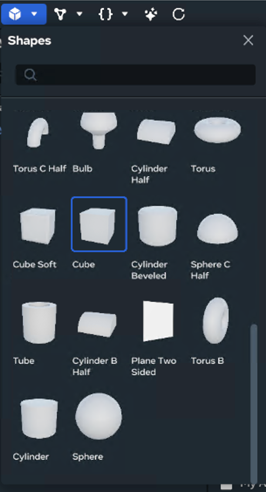

1. **Build** → **Shape** → Cube.  **Drag** or **Right click** and place the cube in the world.
  (you should see the cube model referenced in the Hierarchy)

  **Press F** to zoom out and see the cube.

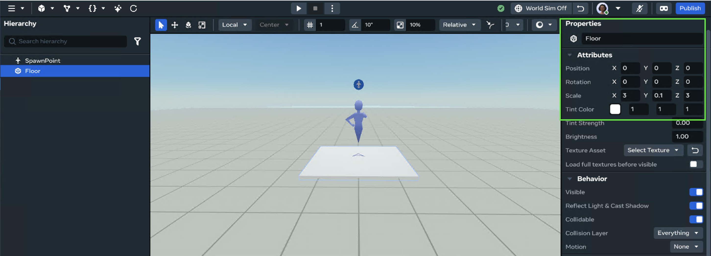

2. Configure the cube’s properties.
- **name** `Floor`
- **position** `x: 0,y :0.5, z: 0`
- **Scale:** `x:3,y: 0.1, z: 3`  


---
## Step 2: Create a Parent Object for the Floor Entity.

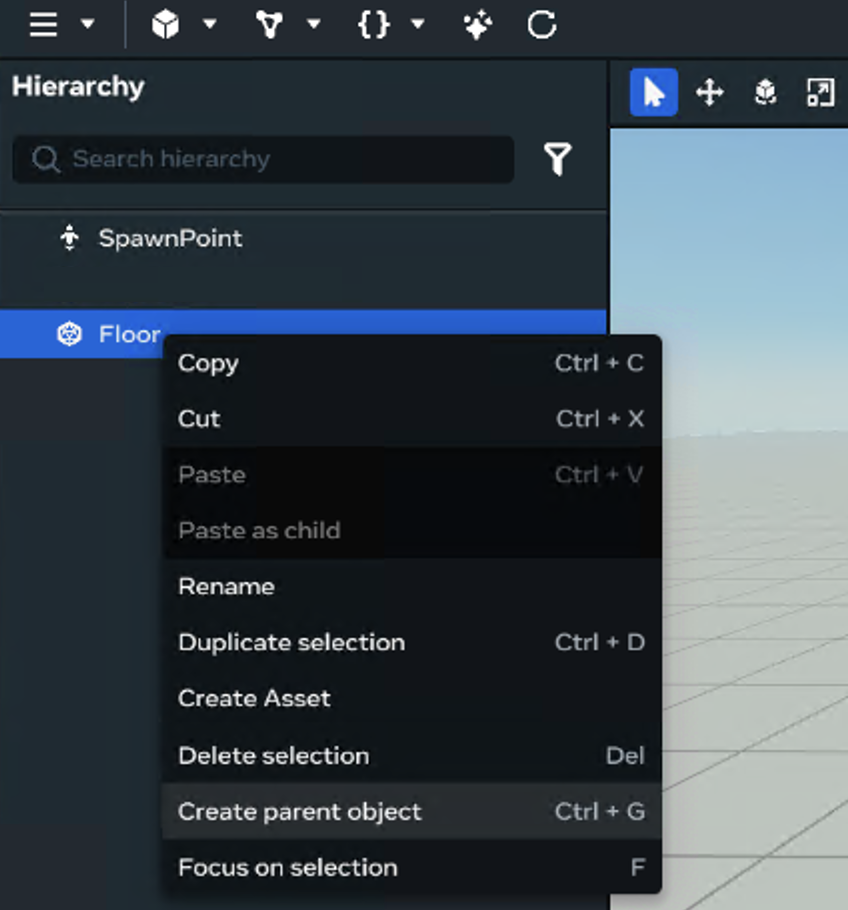

1. **Right-Click** the **Floor** object in the **Hierarchy**.  Select → **Create parent object**. 
- An **Empty Object** is created in the **Hierarchy**. 
- The **Floor Entity** is now contained in the **Empty Object** and is a **Child** of this **Root Entity**
2. Configure the **empty object’s** properties.
- **name**: `Cell`

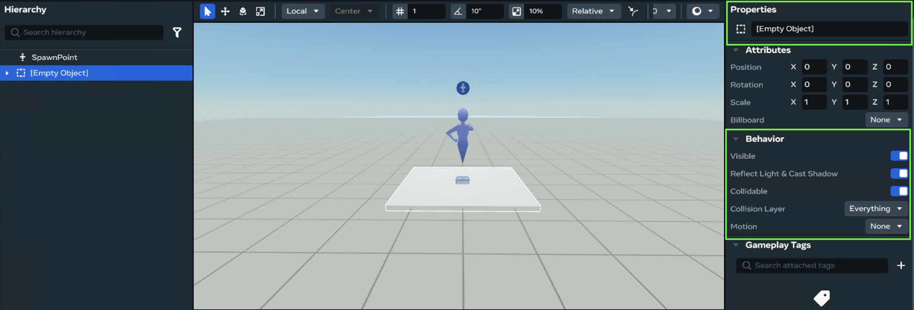

- **Behaviour**

- **Collidable** : off
( turn this off so the root Cell is not interacting in the world) 

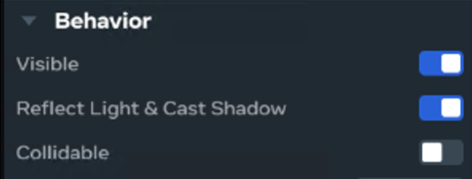

--- 


## Step 2: Create an Asset Template from the Cell Object.

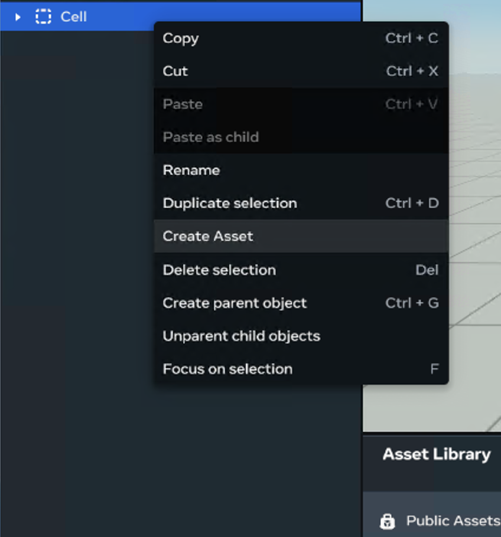


---

1. **Right Click** the Cell object in the **Hierarchy**. Select → **create Asset**. 

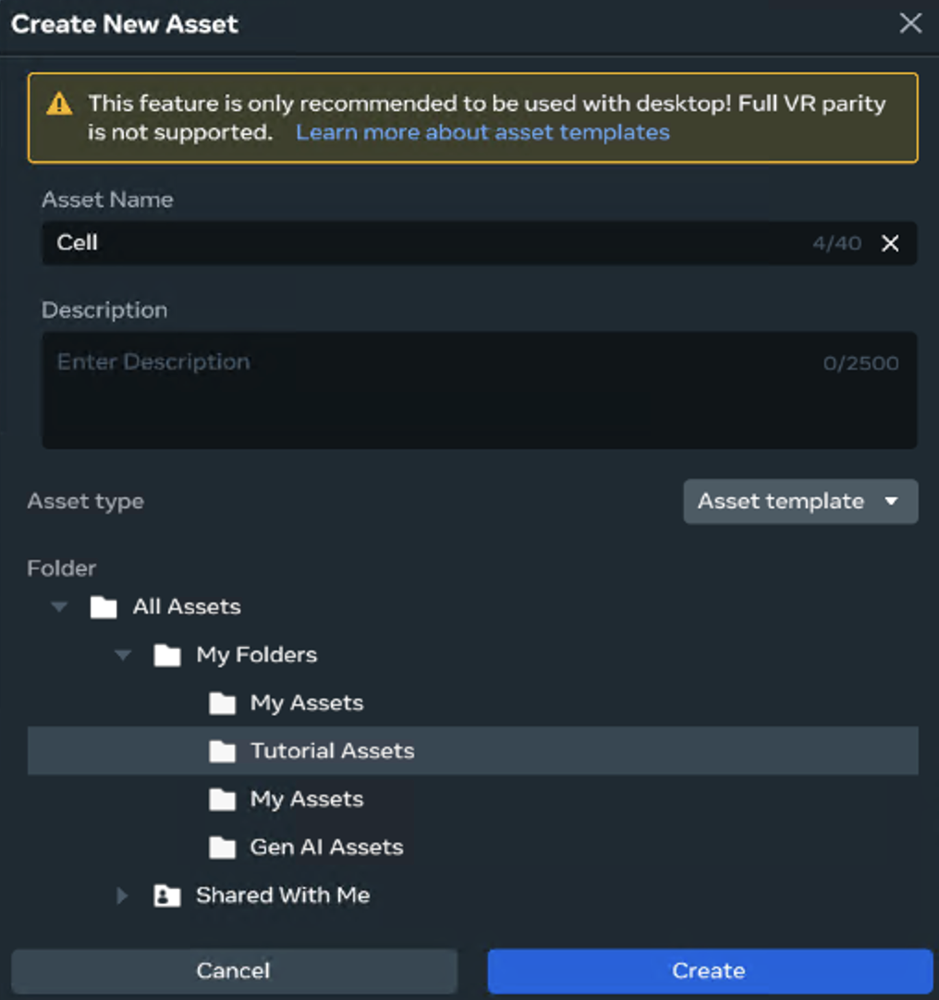

---

2. Configure the **Asset Templates** information.
- **Asset name**: `Cell`
- Select a folder to place the asset.
- Press **Create**


3. Look in the **Asset Library**. 

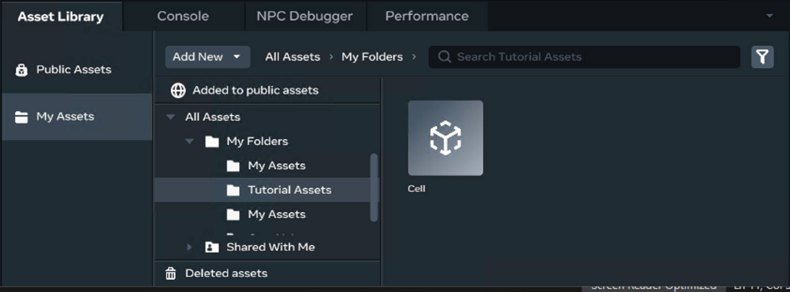
- The asset template is created in the folder you selected in the previous window. 

## Step 3: Let's Make More Cells
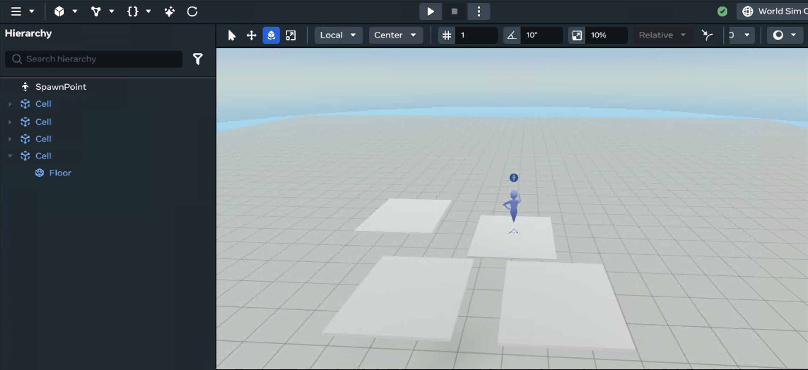
1. **Drag** the **Cell** asset into the window scene and make more cells. 
    - This creates an instance in the world.
    
    - There are now 4 Cells. The original Cell and the three you dragged and placed into the scene.
    
    - Each Cell is the same.
    
    - The Cell is the **Root Object** (empty entity named Cell and the child entity named Floor.)
    
    - The **Cell** Template can be updated and all instances will be changed.


## Step 4: Let's Update the Cells

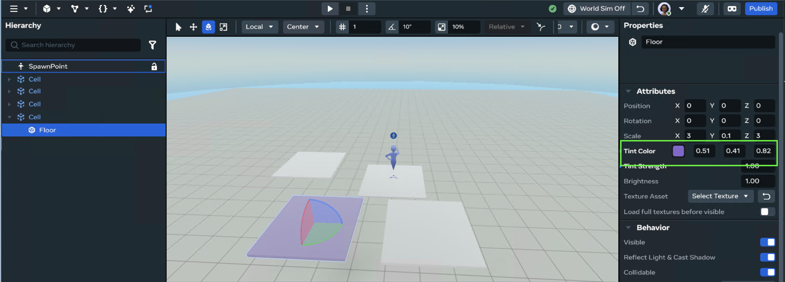
1. Select a **Cell** → then the Child **Floor**. Let's change the **TintColor** property of the **Floor** Entity on the **Cell**.
- This changes only the selected **Cell**.

## What about the other Cells?
Change all cells.


2. Select the **Cell** **Root Object** again, for the **Floor** you changed in the properties window. You will see new information about the changes you made for **Review**. 

3. Click **Review**.

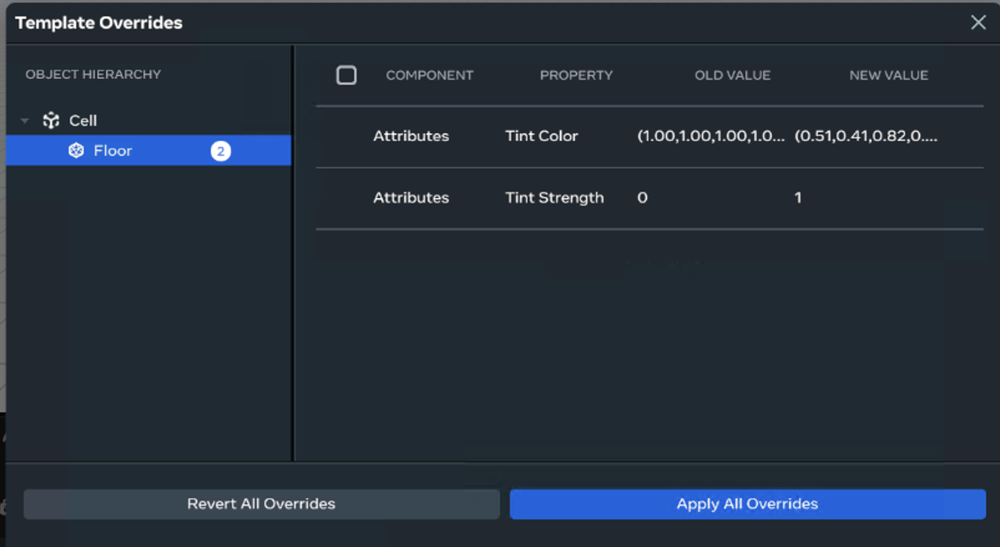

You can now review the changes you made.

- **Revert All Overrides**: cancels all the changes you have made to the 
    **Cell** and will make all **Cells** the same colour again. 

- **Apply All Overrides**: Updates all **Cells** with this change.

4. Click **Apply All Overrides**.

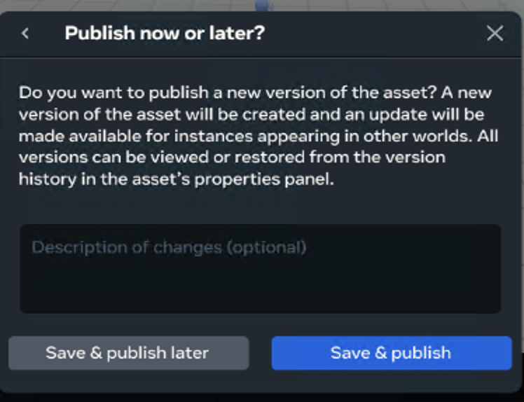

- Asset Templates create a version history for each change, you can change it back to another preferred version later, if you don't like your changes.
### N.B. This is one of the Key differences compared to Unity Prefabs.

- Write a description: e.g. Changed Floor to purple.


4. Click **Save & publish**.

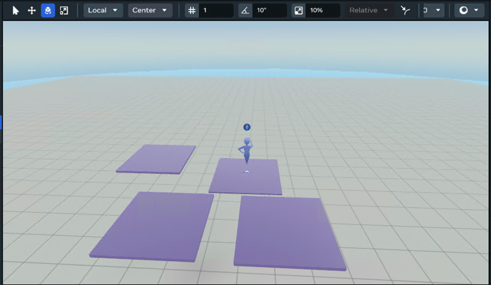

All instances of the **Cell**  have been updated.

---

## Step 5: Let's Unlink one of the Cells
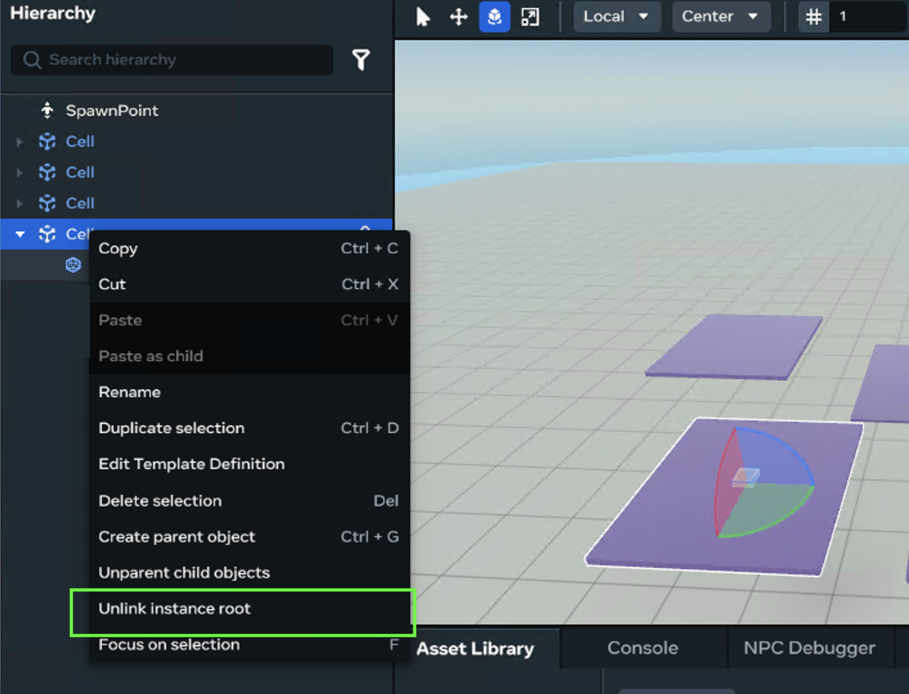

1. Select a **Cell**  →  **Right-click**
2. Select **Unlink instance root**

- It looks like nothing has happened but this instance will no longer update with any future changes.

3. Select a different **Cell**  → Select **Floor** child
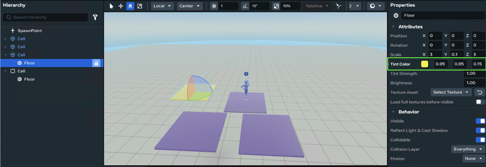
4. Change the **TintColor** property
- **TintColor:** `0.95, 0.95, 0.15` 

5. Review changes on **Cell Root** asset 

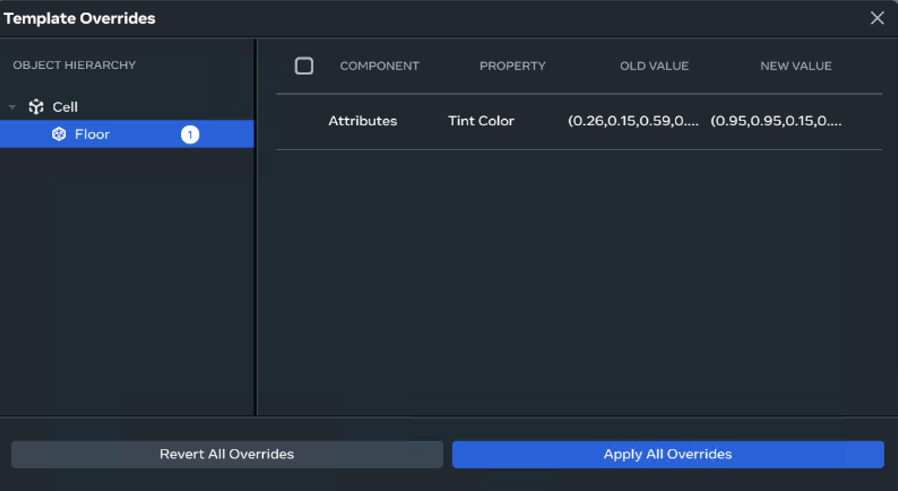

6. Click **Apply All Overrides**.

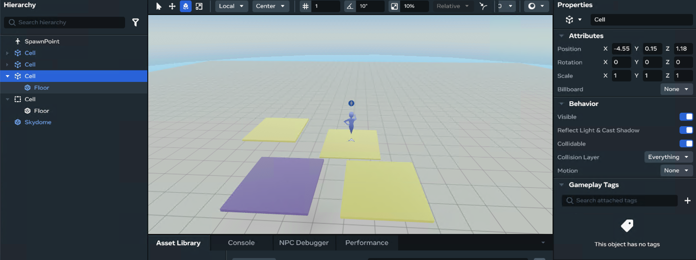

Three of the Cells are yellow and the unlinked instance stays purple!
Great! Depending on what you are creating in your world, dragging a template asset could be all you do. Especially, if you only want a few of the same objects but you can do more in code...

## Using the Asset Template in code

# Why Spawn Assets with Code?

Sometimes it’s tempting to just drag the asset a bunch of times into your world in the editor but spawning them with code has some big advantages:

1. **Make the world feel alive**  
   - You can bring new objects into the scene while the game is running — like spawning enemies, power-ups, or even a surprise event.
   
   - You tie assets to player actions. e.g. Maybe a treasure chest appears only after solving a puzzle, or a new platform spawns when a button is pressed. You can’t do that with pre-placed assets. This makes things feel dynamic instead of static.

2. **Save yourself a ton of work**  
   Instead of placing dozens (or hundreds!) by hand, code can do the heavy lifting. Need 20 crates? A single line of code can drop them in for you.

  
 It's time to create a grid of **Cell** objects. Let's spawn the Cell asset template in code because dragging the **Cell** asset and positioning it by hand would take too long  — and what if you want to change the grid size later? 

## Step 1: Place two empty objects in the Hierarchy

1. Select **Build**  →  **Empty Object**

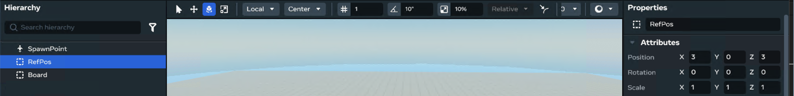

2. Configure the empty object’s properties.
    - **name** `Board`
    - **position** `x:0, y: 0.5, z: 0`
This will be the parent object for the spawned assets Cells.

3. Configure the second empty object’s properties.
    - **name** `RefPos`
    - **position** `x: 3,y: 0, z: 3`

## Step 2: Create a BoardController script

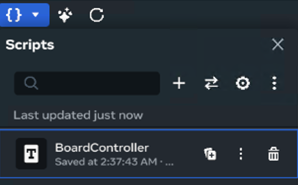

1. Select **Script** → Add a new script → **BoardController**
2. **Double-Click** the **BoardController** script.
Now that you have your cells/tiles, let's write the code that creates the board.

## Step 3: Scripting a Board
### In your code editor: 
It opens the new class attached to the BoardController.

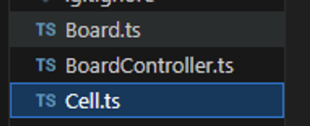

1. Add two helper scripts **Board.ts** and **Cell.ts**

Add:

```typescript
export class Cell {

public x : number;
public y : number;

constructor(x: number , y: number)
{
    this.x = x;
    this.y = y;
}
}
   ```

2. In the Cell class, add x and y variables and a constructor. This creates a coordinate for the cell, to place it on the grid.


Add:

```typescript
export class Board {
width : number;
height: number;

public board : Cell[];

constructor(width: number, height: number)
{
    this.width = width;
    this.height = height;
    this.board = Array.from({ length: width * height }, (_, i) => {
      const x = i % width;
      const y = Math.floor(i / width);
      return new Cell(x, y);
    });
}
  generateBoard()
{
    let index = 0;
    for(var y = 0; y < this.height; y++)
    {
        for(var x = 0; x < this.height; x++)
        {
            const cell = new Cell(x,y);
            this.board[index] = cell; 
            index++;

        }
    }   
}

getRandomNumber() : number
{
return Math.floor(Math.random() * this.board.length);
}
   ```

3. In the **Board class** 
    - Create width and height variables. These are used to set the size of the Board (in number of cells).

    - Create an array of Cells from the **Cell** class that will be used for the board. 

    - The constructor will set the **size** of the board and create a board based on the width and height.
    
    - Create a **GenerateBoard** function to create new cells with a set coordinate and add it to the board array.
    
    - Create a **getRandomNumber** function to return a random cell based on the board size (provides easy access later).


Add:

```typescript
import { Component, Entity, Player, NetworkEvent, PropTypes, Vec3, Quaternion, AssetContentData, MeshEntity, SpawnController } from "horizon/core";

import { Board } from "Board";

class BoardController extends Component<typeof BoardController> {
 static propsDefinition = {
    cellTemplate: {type: PropTypes.Asset },
    refPos: {type: PropTypes.Entity},
    spacing: { type: PropTypes.Number, default: 1.0 },
 };
  
  start() {  }

   }
Component.register(BoardController);
   ```

4. In the **BoardController**

   - Create three properties in the propsDefiniton. This gives us external access to link created entities.
   
   - **CellTemplate** links to the **Cell Asset Template**
   
   - **RefPos** links to **RefPos** in the World **Hierarchy**
   
   - spacing is a default property to create proper spacing on the board.


Add: (Below PropsDefinition ) 

```typescript
  board = new Board(5,5);
  cells = [];
  private cellList: Entity[] = new Array<Entity>();
  static instance : BoardController | undefined;
 


  preStart(): void {
    BoardController.instance = this;
}

  start() {}
  ```

- **board** variable that creates a board array with the **width** and **height** set to 5. (You can set it to whatever works well in your world.)

- **cellList** will hold the spawned cells created for the board which will hold a position and a cellTemplate.

- The class defines an instance of **BoardController**. This allows us to make sure that only one **boardController** is present in the world at runtime. It's set in **preStart**, usually this will run before any of the other items run in the world lifecycle.


Add:

```typescript
 start() {
  
this.setUp();
  }
// create board data and board
   setUp()
{
  this.board.generateBoard();
  this.buildBoard();
}

 async buildBoard()
  {
      if (!this.props.cellTemplate) {
            console.error(' component requires a cell prop');
            return;
        }
    let cellIndex = 0;
     
    for(var y = 0; y < this.board.height; y++)
    {
        for(var x = 0; x < this.board.height; x++)
        {
         
           //Create obj
            if(cellIndex < this.board.board.length + 1)
            {
              const cell = this.props.cellTemplate;
           const pos  = new Vec3((this.props.refPos!.position.get().x) * (this.board.board[cellIndex].x   + this.props.spacing), 0,(this.props.refPos!.position.get().z) * (this.board.board[cellIndex].y + this.props.spacing));
     const spawnedObjs  = await this.world.spawnAsset(this.props.cellTemplate!, pos, this.props.refPos!.rotation.get())
  
            if(this.cellList == null) return;
                spawnedObjs.forEach(obj => {
    
                 (obj as any).setParent?.(this.props.refPos);
                
            
         this.cellList.push(obj);
         console.log(this.cellList.length);

                });
              console.log(cellIndex);
         
            }
               cellIndex++;
       }
    }
        console.log('SimpleSpawn: spawning complete. objList size='+this.cellList.length);
}
        
   ```

5. Create a function named **setUp**, in **start** call this function.
- In **setUp**, first generate the data for the board. Using **this.board.generateBoard()** it runs the method created earlier.

6. Create a **buildBoard** function.
- First it checks **this.props.cellTemplate** is not **null**. 

- Uses a **for loop** to spawn cells, first on the **y** axis and then on the **x** axis for the rows and columns using the width and height defined in the board class.

- Uses the board data to generate the board using the **this.world.spawnAsset()**. 
- **this.world.spawnAsset()** takes the created **asset Template** named **cellTemplate** (the one created earlier), spawns it at a given position and rotation and then produces an array of newly spawned cells. These cells are **Cell entities** and have access to the class methods and anything defined in the **cellTemplate** **Root Object** in this case the **Floor**. 

- The cells are added to the **CellList** array defined at the top of the class, for use within the code.


7. Save the script and return to the World Editor.


 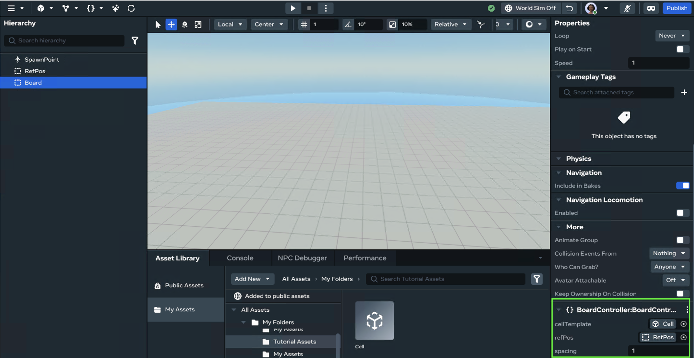

8. Attach the **BoardContorller.ts** to the **board** object in the **Hierarchy**. 

  

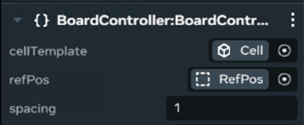

9. Click the slot for the refPos. Add the refPos from the **Hierarchy**
  
   Click to add or drag from the asset folder to the slot.

   **spacing** has a default, so nothing to do here.


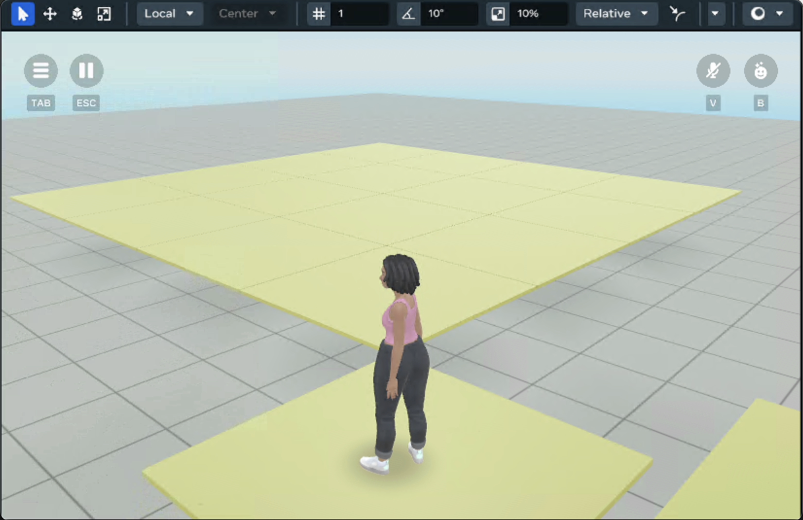

Hit **Play**. You can now see the board of Cells! (You can delete all the cells from earlier)

   
That's it. You have a procedurally generated board! 
Right now everything is visual, the board is only a collection of cells. 
Using the board data you can access and configure different cells. It's far from complete but you have (hopefully) learned more about Asset Templates, the when, how and why to use them.
At this point you can take a break or continue to make a procedurally generated maze!

### Let's get started!

# Build (Long tutorial)

## Update the Asset Template in the Horizon World Editor

This part shows how to update the **Asset Template** in Horizon Worlds to generate the maze.

## Step 1: Update the Asset Template

1. In the Asset Library, right-click the **cell** Asset. 

2. Select **Edit Template Definition**

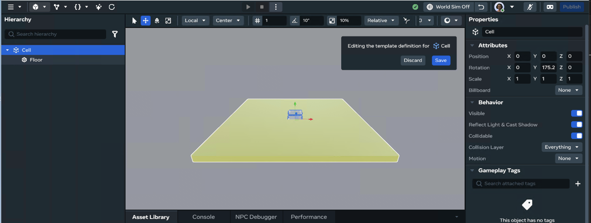

## Step 2: Place a cube shape in the Template


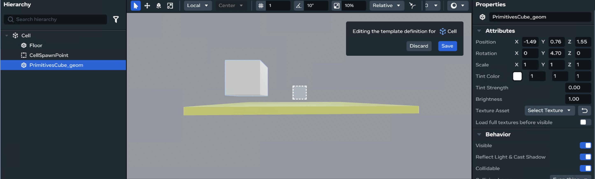

1. **Build** → **Shape** → Cube.  **Drag** or **Right click** and place the cube in the Edit template scene.


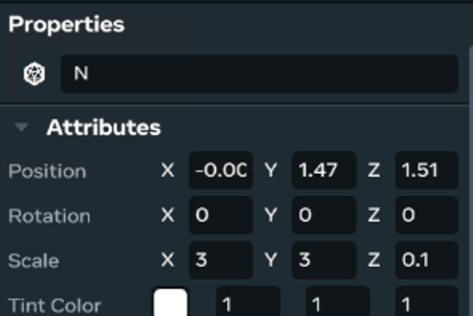

2. Configure the cube’s properties.

- **name**: `N`
- **position** `x: 0,y :1.47, z: 1.50`
- **rotation** `x: 0,y :0, z: 0`
- **Scale:** `x:3,y: 3, z: 0`

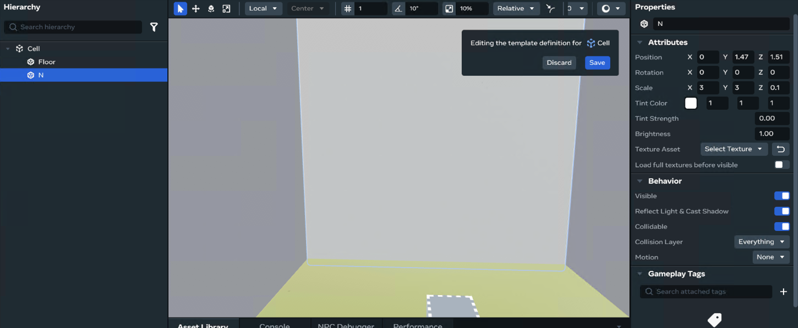

3. Duplicate **N** entity three more times.

4. Configure all: 

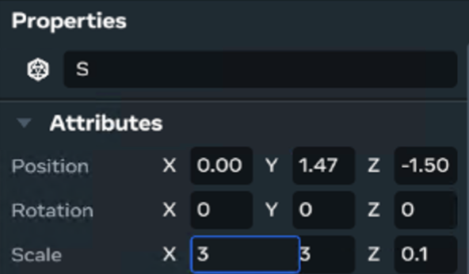
- **name** :`S`
- **position** `x: 0,y :1.47, z: 1.50`
- **rotation** `x: 0,y :0, z: 0`
- **Scale:** `x:3,y: 3, z: 0` 
---


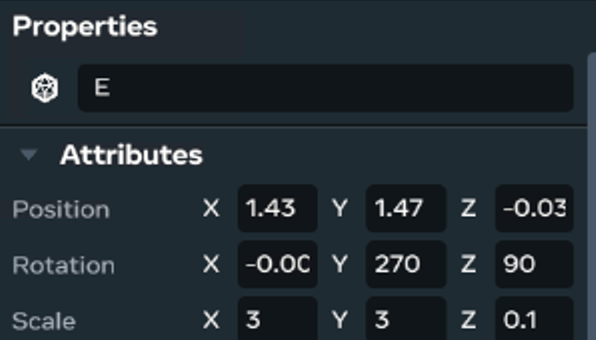

- **name**: `E`
- **position** `x: 1.43,y :1.47, z: 0.03`
- **rotation** `x: 0,y :270, z: 90`
- **Scale:** `x:3,y: 3, z: 0`
---


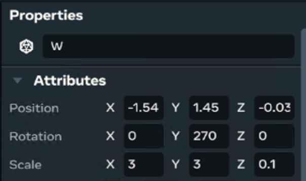

- **name**:`W`
- **position** `x: 1.54,y :1.47, z: 0.03`
- **rotation** `x: 0,y :270, z: 0`
- **Scale:** `x:3,y: 3, z: 0`

---
N.B You may have to position them so it looks right in your template.

The cell should now look like this: 

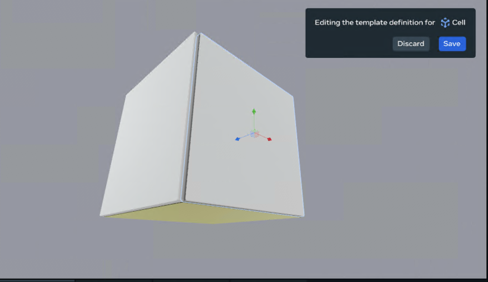

---


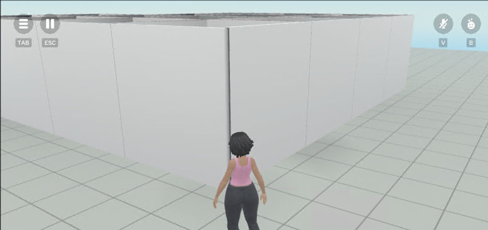

5. Save the changes. Return to the editor. Press **play** the board is now spawning cell blocks.


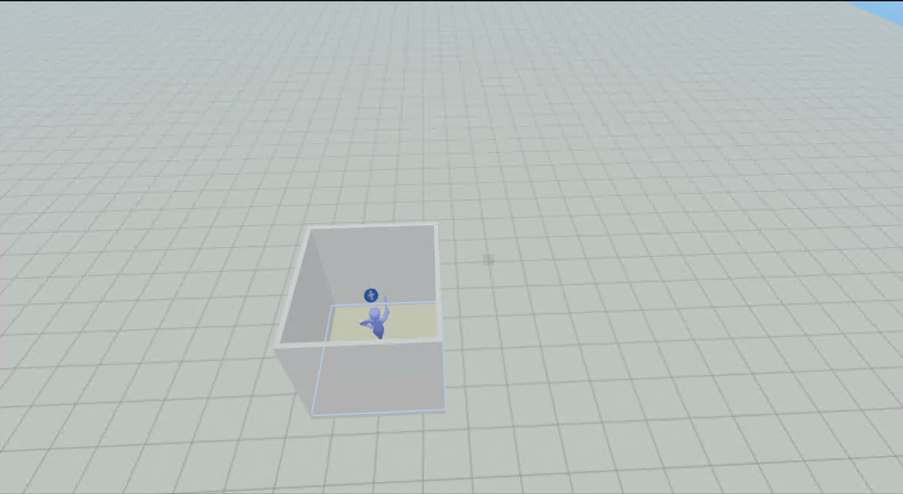

You can drag a cell from the **Asset Library** to see it as well.

## Step 2: Update the scripts

Add:
```typescript

hasBeenVisited = false;
north = true;
south :boolean = true;
east : boolean = true;
west : boolean = true;


//below constructor

 returnWalls() : string[]{
        let walls : string[] = [];
        if(this.north)
        {
            walls.push("N");
        }
        if(this.south){
            walls.push("S");
        }
        if(this.east) {
            walls.push("E");
        }
        if (this.west) {
            walls.push("W");
        }

        return  walls;

    }

```

1. In **Cell.ts** , create seven variables all with a default value. 
    - **hasBeenVisited**  helps the board keep track of the cells during creation.
    
    - **north, south, east, west** correspond to the **cell Template Asset walls created with N, S, E, W**. 
    
    - **Below the class constructor** , create a **returnWalls** function to reference these walls
    
    - The walls data will be generated by the **generateBoard** function in **Board.ts**.


4. In **Board.ts**, update the **generateBoard** method
      - The function will now access the information in the board array of cells and create the walls for the maze.


```typescript

generateBoard()
{
    
    let index = 0;
    for(var y = 0; y < this.height; y++)
    {
        for(var x = 0; x < this.height; x++)
        {
            const cell = new Cell(x,y);
            this.board[index] = cell; 
            index++;

        }
    }
    // Add the following


 const initPos : number = this.getRandomNumber();
    this.board[initPos].hasBeenVisited = true;
    //generate maze data
    let stack : number[] = [];
    stack.push(initPos);
    while(stack.length > 0)
    {
        console.log('stack' + stack.length);
        const pos : number = stack.pop()!;
        const neighbours : number[] = this.getUnvisitedNeighbours(pos);
        
        if(neighbours.length > 0)
        {
            stack.push(pos);

           const nxInd : number = Math.floor(Math.random() * neighbours.length);
           const nxPos = neighbours[nxInd];
           this.removeWall(pos,nxPos);
           this.board[nxPos].hasBeenVisited = true;
           stack.push(nxPos);
        }

    }
}


getUnvisitedNeighbours(index : number) : number[] 
{
    let neighbours : number[] = [];
    //check if the surrounding squares have been visited
    if(index === 0 && !this.board[index + this.width].hasBeenVisited)
    {
        neighbours.push(index + this.width);
    }
    //top
    if(index + this.width < this.board.length && !this.board[index + this.width].hasBeenVisited)
    {
        const sum : number = index + this.width;
        neighbours.push(sum);
    }
    //bot
    if(index - this.width >= 0 && !this.board[index - this.width].hasBeenVisited)
    {
        const sum = index - this.width;
        neighbours.push(sum);

    }

    //right
    if(((index + 1) % this.width != 0) && !this.board[index + 1].hasBeenVisited)
    {
        const sum = index + 1;
        neighbours.push(sum);
    }

    //left
    if((index % this.width != 0) && index - 1 >= 0 && !this.board[index - 1].hasBeenVisited)
    {
        const sum = index - 1;
        neighbours.push(sum);
    }


    return neighbours;
}

removeWall(currentIndex: number, nxIndex: number)
{
    //top
    if(nxIndex < this.board.length && (currentIndex + this.width) === nxIndex)
    {
        this.board[currentIndex].north = false;
        this.board[nxIndex].south = false;
    }

    //bot
    if((currentIndex - this.width)  >= 0 && currentIndex - this.width === nxIndex)
    {
        this.board[currentIndex].south = false;
        this.board[nxIndex].north = false;
    }
    //right
    if(currentIndex + 1 === nxIndex)
    {
        this.board[currentIndex].east = false;
        this.board[nxIndex].west = false;
    }
    //left
    if(currentIndex - 1 >= 0 && currentIndex - 1 === nxIndex)
    {
        this.board[currentIndex].west = false;
        this.board[nxIndex].east = false;
    }
}

```

4. In **BoardController.ts**, the only thing to do is hide the walls in the **cellTemplate** from the new information created by the **generateBoard** function for the **Cells** in **Board.ts**.

- In **spawnedObjs.forEach** in the **buildBoard** function. Place the new code.


```typescript
   // ...existing code above

  // new code here
       spawnedObjs.forEach(obj => {
    
                 (obj as any).setParent?.(this.props.refPos);
             
                  var walls = obj.children.get();
                  // //setup walls //search wall and hide at that index
                   for(var x = 0; x < obj.children.get().length; x++)

        {
                if(!walls[x].exists()) return;
              const wall = walls[x];
             const wall_name = wall.name.get();
         
          if( wall_name === "N" && !this.board.board[cellIndex].north)
          {
            //hide
            console.log(wall)
            wall.visible.set(false);
            
            
          }
          if( wall_name === "W" && !this.board.board[cellIndex].west)
          {
            //hide
             wall.visible.set(false);
            
          }
          if( wall_name === "S" && !this.board.board[cellIndex].south)
          {
            //hide
             wall.visible.set(false);
            
          }
          if( wall_name === "E" && !this.board.board[cellIndex].east)
          {
            //hide
             wall.visible.set(false);
            
          }
        }
         this.cellList.push(obj);
         console.log(this.cellList.length);

     });


```

That's it! Return to the World Editor

5. Press **play**, you can now see the maze being spawned.

The last thing to do is create a cell reference point so you can spawn a door or a special object at run time.

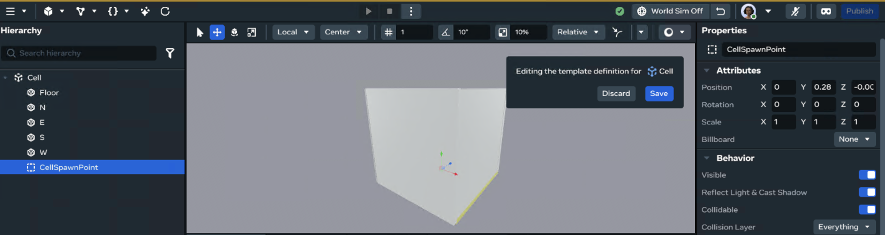

   - Edit **Template Definition** (You remember how to do that right?) 
    
   - Create an empty object from the **Build** menu
    
- **name**: `CellSpawnPoint`
- **position**: `x: 0,y: 0, z: 0`

---


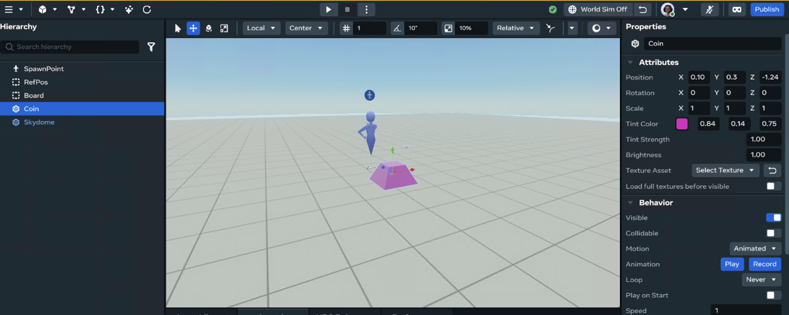


6. Create a Coin
   - Use any shape from the shapes 
   - Change the color property to whatever you like. (this is just to test out the **cellSpawnPoint**)

---

Add:

```typescript
 static propsDefinition = {
                    
  // ...existing code above
// new code here
coin: {type: PropTypes.Entity}
}


buildBoard(){
    // ...existing code above

  // new code here
  this.setupCoinPositions();
      }
   
setupCoinPositions()
{

    let coinPos = this.board.getRandomNumber();
    let cellRefPoint = this.cellList[coinPos].children.get()


for(var x = 0; x < cellRefPoint.length; x++)

    {
        if(!cellRefPoint[x].exists()) return;
        const spawnPoint = cellRefPoint[x];
        const spawnPointName = spawnPoint.name.get();
         
   if( spawnPointName === "CellSpawnPoint"){
  this.props.key?.position.set( spawnPoint.position.get());
  console.log("place item");
  }
}
}

```

7. In **BoardController.ts** 

    - Add a property to reference the external **Coin** entity

8. Add a **setupCoinPosition** function

   - It creates a random number based on the cell board.

   - Checks the cellTemplate children exist.

   - Loops through all the children for the cell entity and finds the **cellSpawnRefPosition** that you created.

   - Sets the coin to this position.
    
   - Below the walls, set up in the **buildBoard** function, call the **setupCoinPosition** function


That's it! Return to the World Editor

9. Remember to add the coin reference to the external variable slot on the *board entitity* in the **Hierarchy** with the **BoardController** script.

10. Press **play**, you can now see the maze being spawned and the **coin** object being moved into position.

You have the start for generating a procedural maze and placing objects inside. This is just one way to do it. It's up to you to keep on exploring. Some things to consider as your maze needs colliders for the walls, enemies, doors and whatever you can build!

# Wrapping Up 

You’ve just learned the essentials of **Asset Templates** — what they are, how to create them, when to use them, and why they are useful.  

- You now know how to **build and save templates** so you can reuse content without rebuilding it every time.  
- You have seen how **updates flow** to all your instances using overrides on the root.  
- You know when to **spawn assets with code** instead of dragging them in by hand — perfect for making your worlds more dynamic and responsive.  

With these tools, you can start building smarter, faster, and more creatively. 

And don’t keep those creations to yourself! It would be wonderful to see what you come up with. Share your worlds, and ideas in the **community forums**, so we can all get inspired.

Thanks for following along! 

Happy building!

Helpful links: 


[https://developers.meta.com/horizon-worlds/learn/documentation/desktop-editor/assets/asset-templates?utm_source=chatgpt.com](https://developers.meta.com/horizon-worlds/learn/documentation/desktop-editor/assets/asset-templates?utm_source=chatgpt.com)

[https://developers.meta.com/horizon-worlds/reference/2.0.0/core_entity](https://developers.meta.com/horizon-worlds/reference/2.0.0/core_entity)

Full script: 
```typescript

import { Component, Entity, Player, PropTypes, Vec3 } from "horizon/core";
import { Board } from "Board";

class BoardController extends Component<typeof BoardController> {

  static propsDefinition = {
                    
    cellTemplate: {type: PropTypes.Asset, },
    refPos: {type: PropTypes.Entity},
    spacing: { type: PropTypes.Number, default: 1.0 },
    coin: {type: PropTypes.Entity},
    

   
  };
 
  board = new Board(3,3);
  static instance : BoardController | undefined;
  cells = [];


  private cellList: Entity[] = new Array<Entity>();


  preStart(): void {
    BoardController.instance = this;
    }

  start() {
  
    this.setUp();
  }
 setUp()
{
  this.board.generateBoard();
  this.buildBoard();
}
 async buildBoard()
  {
      if (!this.props.cellTemplate) {
            console.error(' component requires a cell prop');
            return;
        }
    let cellIndex = 0;
     
    for(var y = 0; y < this.board.height; y++)
    {
        for(var x = 0; x < this.board.height; x++)
        {
         
           //Create obj
            if(cellIndex < this.board.board.length + 1)
            {
              const cell = this.props.cellTemplate;
           const pos  = new Vec3((this.props.refPos!.position.get().x) * (this.board.board[cellIndex].x   + this.props.spacing), 0,(this.props.refPos!.position.get().z) * (this.board.board[cellIndex].y + this.props.spacing));
     const spawnedObjs  = await this.world.spawnAsset(this.props.cellTemplate!, pos, this.props.refPos!.rotation.get())
  
            if(this.cellList == null) return;
                spawnedObjs.forEach(obj => {
    
                 (obj as any).setParent?.(this.props.refPos);
                
            
         this.cellList.push(obj);
       

                });
             
         
            }
               cellIndex++;
       }
    }
       
}

setupCoinPositions()
{

    let coinPos = this.board.getRandomNumber();
    let cellRefPoint = this.cellList[coinPos].children.get()


for(var x = 0; x < cellRefPoint.length; x++)

    {
        if(!cellRefPoint[x].exists()) return;
        const spawnPoint = cellRefPoint[x];
        const spawnPointName = spawnPoint.name.get();
         
   if( spawnPointName === "CellSpawnPoint"){
  this.props.coin?.position.set( spawnPoint.position.get());
  
     }
    }
   }
        
  }


Component.register(BoardController);

```
