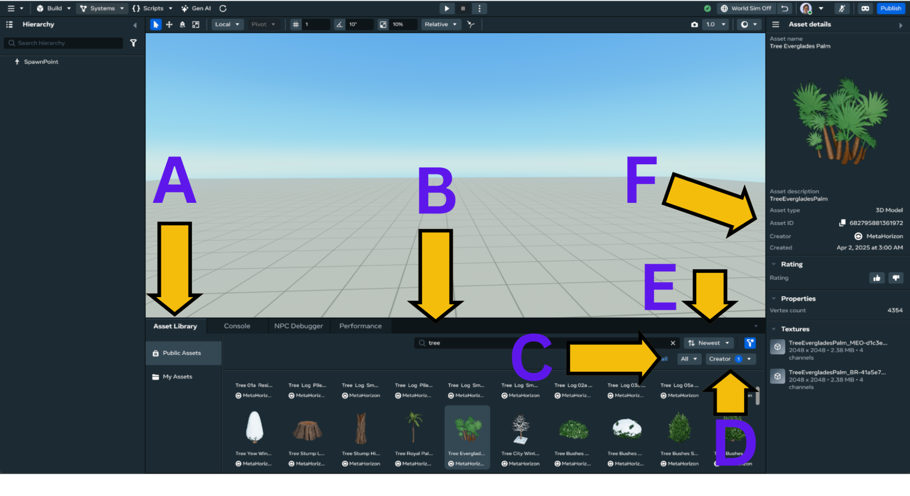
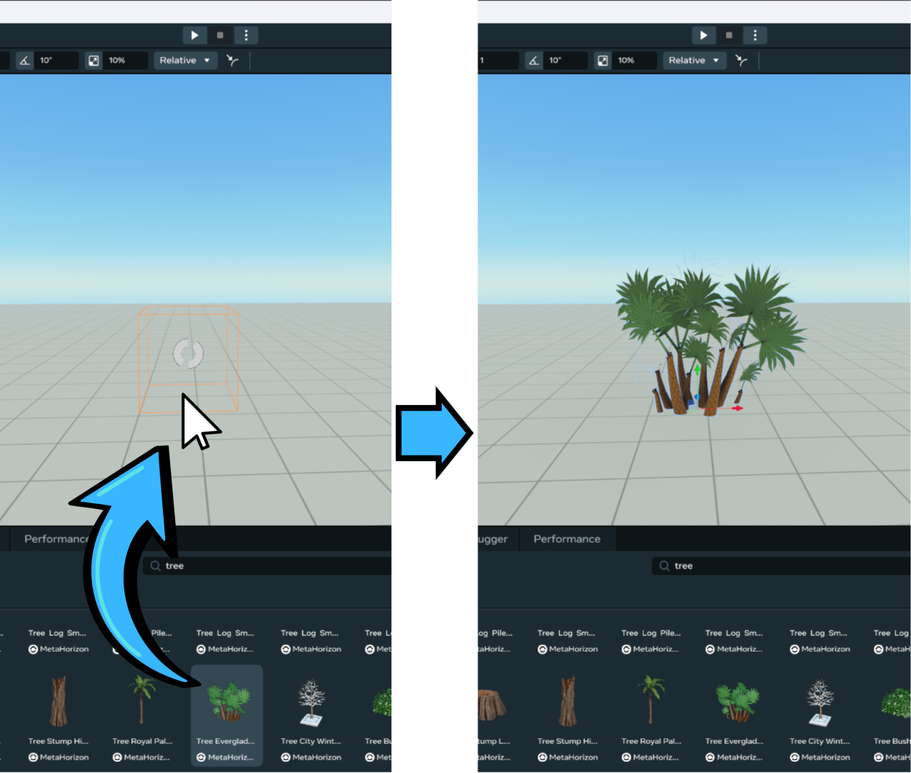
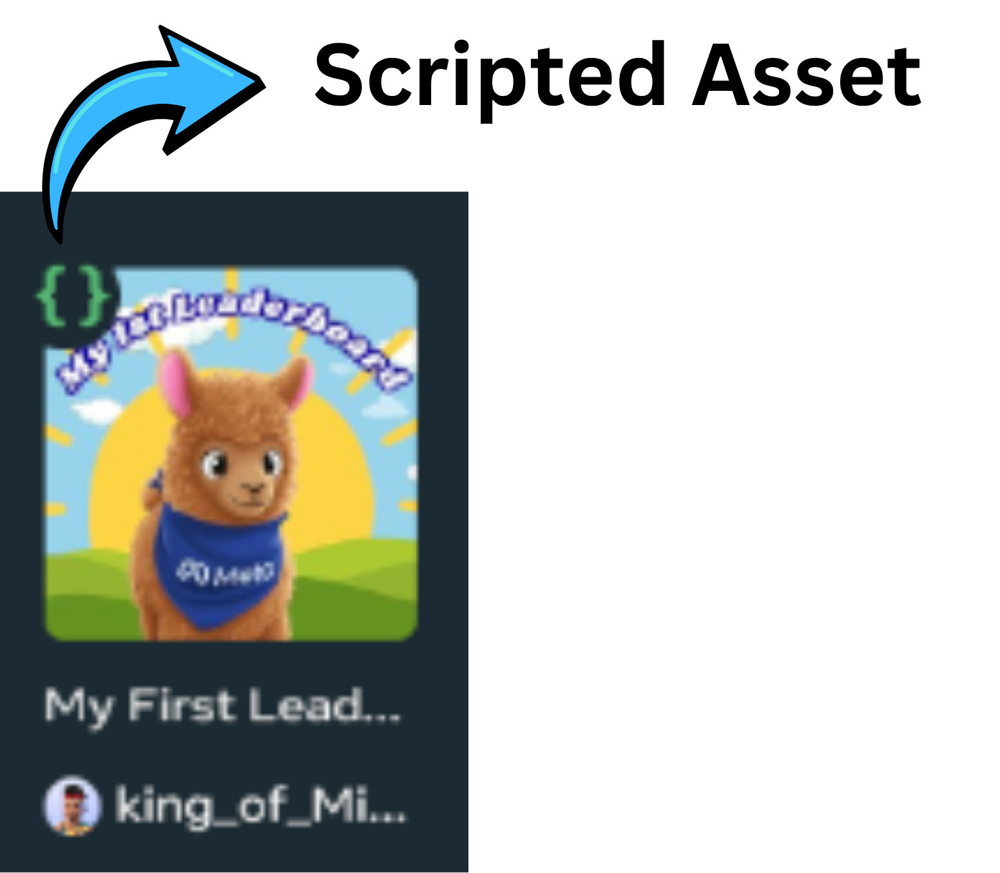
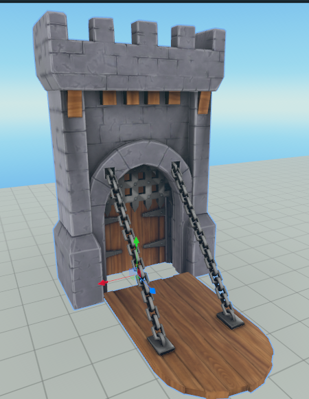
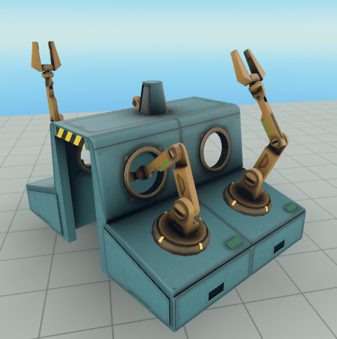
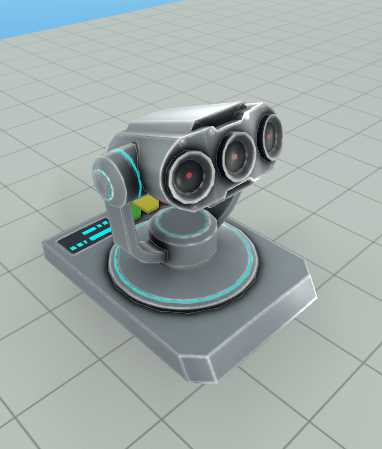
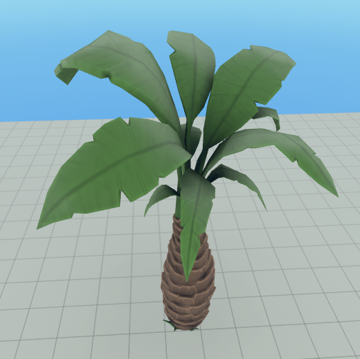
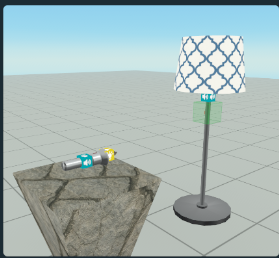
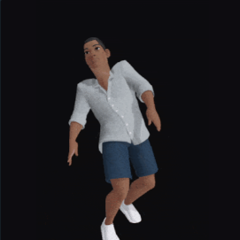
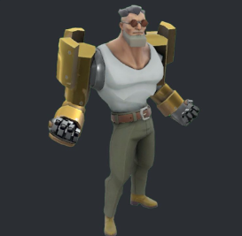

# Assets Reference Guide: Horizon Public Asset Library

## How to Access
1. From the Desktop Editor, open the Asset Library tab  
2. Use the search bar to find assets by **name or keyword**  
3. Filter by asset **category**  
4. Filter by **creator name**  
5. You can sort by highest rated, newest, oldest or alphabetically  
6. When you select an asset you can see its **asset ID**. Use this number to validate that you have found the asset suggested in this document.\

## How to Use
To use an asset in your world, simply drag and drop it into the scene:\

## Scripted Assets
Some assets include full mechanics with 3D models, Custom UIs and scripting. These assets can be identified by the green curly braces that appear at the upper left corner of the thumbnail.\

## Recommended Creators
* Meta Official Account:   
  * MetaHorizon - A very large list of asset including 3D model, scripted assets, visual effects, sound effects, animated characters and much more  
* MHCP and WCA Mentors: 

| MHCP or WCA Mentor Name | Asset Types |
| ----- | ----- |
| Shards632 | Scripting |
| gausroth | Scripting |
| SpaceGlitterUnicorn | 3D Models |
| Tellous | Scripting |
| MKE\_TheGuru | Scripting |
| king\_of\_Miami | Scripting |
| PigeonNo12 | Scripting |

* Community Creator  
	* Vidyuu - An extensive list of reusable mechanics

## Recommended Assets Categories

### Fantasy/Medieval

* C**ategories:** Structures \- Interiors \- Environment \- Lights \- Weapons

* Keywords: Treasure \- Castle \- Magic \- Potion \- Column \- Stone \- Arc\
\
Name: Portculis Drawbridge  
Category: Structures  
Asset ID: 981830410169214 

### Modern/Urban

* Categories: Structures \- Vehicles \- Interiors

* **Keywords:** Vehicle \- Sign \- Light \- Factory\
\
**Name:** Factory Machine Assembly Line  
**Category:** Interiors  
**Asset ID:** 1819656162131855

### Sci-Fi

* **Categories:** Structures \- Electronics \- Interiors \- Vehicles

* **Keywords:** Space \- Laser \- Crate\
\
**Name:** Laser Beam Emitter  
**Category:** Interiors  
**AssetID:** 2234215763680099

### Nature/Outdoors

* **Categories**: Environments \- Animals \- Food

* **Keywords**: Flower \- Tree \- Rock \- Ocean \- Fruits\
\
**Name:** Date Palm Tree  
**Category:** Environment  
**AssetID:** 1606762920029822

### Special Categories

* **Interactive:** Many reusable scripted mechanics, these can be a great source to learn how to use the different Horizon Worlds APIs\
\
**Name**: Lamp & Flashlight (Torch)  
**Creator**: Vidyuu  
**Asset ID**: 1912614015979361  
**Category**: Interactive

* **VFX:** A curated collection of visual effects created with PopcornFX. These can be controlled with scripting just like the Particle Effects Gizmo.\
\
**Name**: Sparkles B  
**Creator**: MetaHorizon  
**Asset ID**: 1552051715509401  
**Category**: VFX

* **Audio:** A large repository of music, sound effects and ambient sounds.\
\
**Name**: SFX\_Rain\_in\_Dessert\_Amb\_Loop  
**Creator**: MetaHorizon  
**Asset ID**: 1642526946251951  
**Category**: Audio  
**Subcategory**: Ambient

* **Avatar Animations:** These animations can be applied to the player avatar on mobile and web.\
\
**Name**: Knock Down (Right Shoulder)  
**Creator**: MetaHorizon  
**Asset ID**: 2248856388909561  
**Category**: Avatar Animations

* **NPC:** These are Unity Asset Bundle characters containing animations and interactions that can be triggered with scripting.\
\
**Name**: NPC Henchman  
**Creator**: MetaHorizon  
**Asset ID**: 629002330062181  
**Category**: NPC

## GitHub: Code Examples

Looking for code examples? Here’s a curated list of documentation and code snippets that demonstrate how to use Horizon APIs through the Desktop Editor

| Description | Link |
| ----- | ----- |
| A large collection of code snippets that demonstrate common APIs functionalities, created by Tellous, a MHCP mentor | [GitHun: HorizonWorldsSnippets](https://github.com/tellous/HorizonWorldsSnippets) |
| Meta provided code snippets, including backed logic for one of the most popular PvP games Super Rumble, by Ouro | [GitHub: meta-horizon-worlds-sample-scripts](https://github.com/meta-quest/meta-horizon-worlds-sample-scripts) |
| Official MHCP GitHub, with a direct link to a compilation of documents and sheet cheats to get you started | [Get started With Creator made documentation \- MHCP Creator Made Docs](https://mhcpcreators.github.io/worlds-documentation/docs/manuals-and-cheat-sheets/get-started/) |