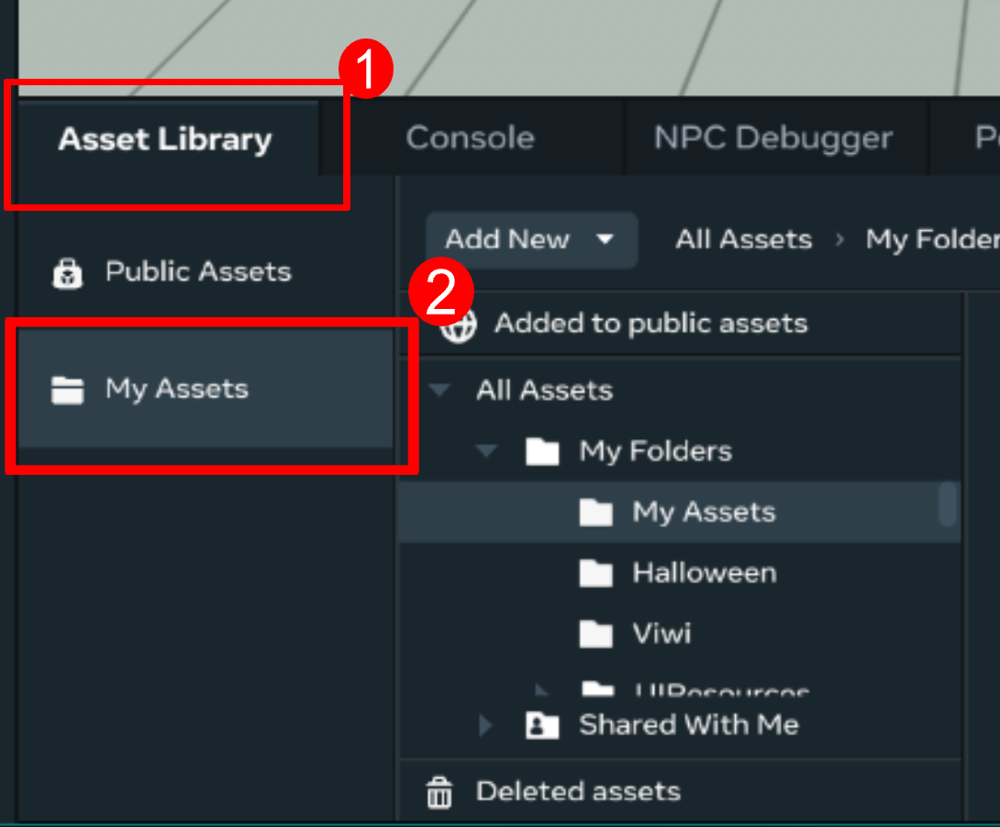
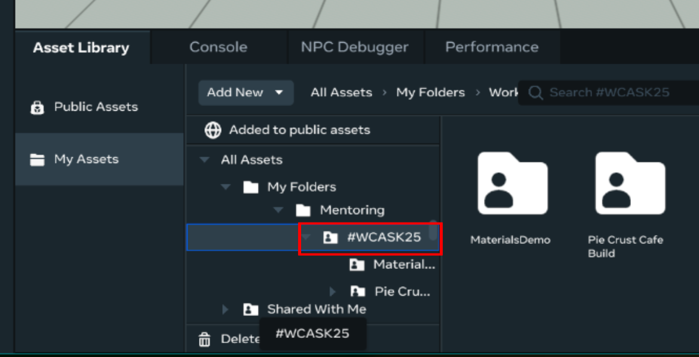
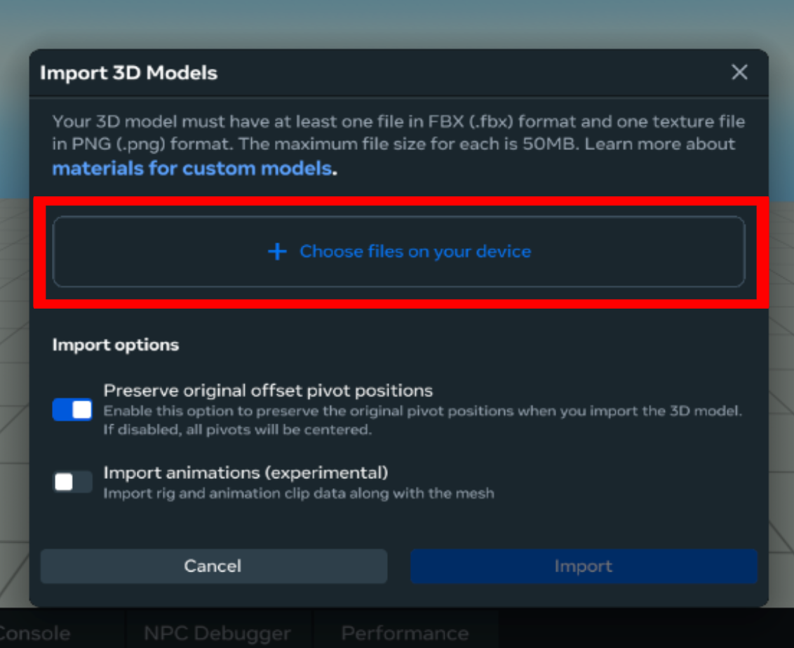
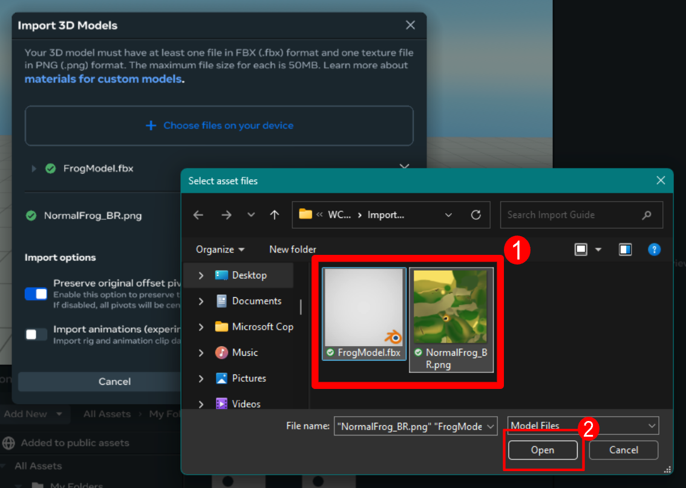
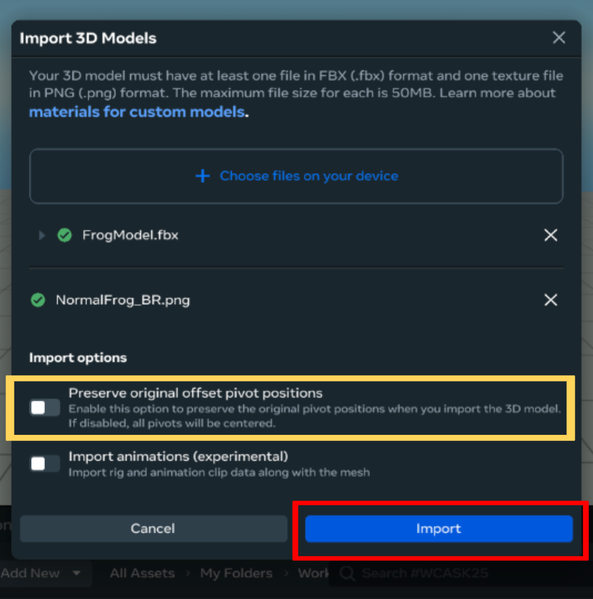
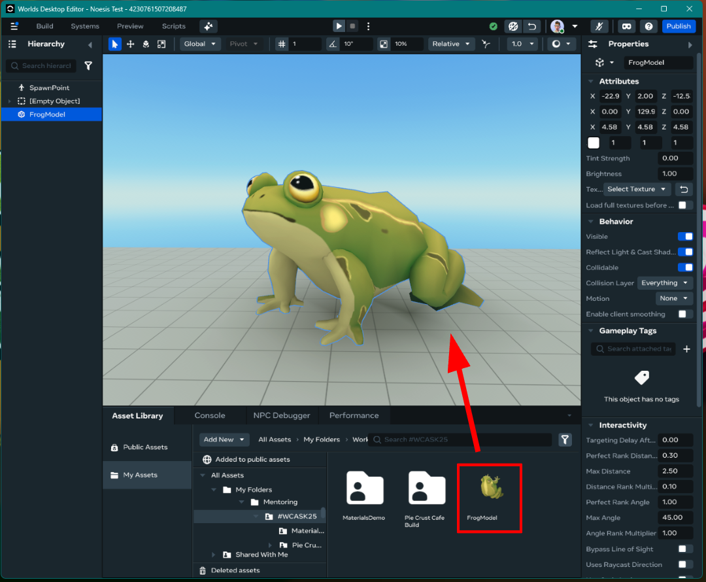

# Importing Custom Models in Meta Horizon Worlds Desktop Editor

### Related Links:
* [Developer Documentation: Materials Guidance](https://developers.meta.com/horizon-worlds/learn/documentation/custom-model-import/creating-custom-models-for-horizon-worlds/materials-guidance-and-reference-for-custom-models)  
* [Developer Documentation: Custom Model Import Best Practices](https://developers.meta.com/horizon-worlds/learn/documentation/custom-model-import/creating-custom-models-for-horizon-worlds/best-practices)

## When to use:
*Use this when you are ready to import a custom fbx model to use within your world*
To upload a custom model in edit mode: 
1. Open the **Asset Library** and select **My Assets**\

2. **Select the folder** where you want to save your asset\

3. Click **Add New** and select **3D Model**\

4. Select **Choose files on your device** from the popup window\

5. **Select the .fbx and .png files** from your computer’s file browser popup and press **Open**\

6. Press **Import** to begin the upload\
**TIP**: If you .fbx file contains multiple meshes, **uncheck “Preserve original offset pivot points”** to avoid warnings/errors\

7. **Click and drag the uploaded asset into your scene**\

### You now have a custom model ready to use in your world!