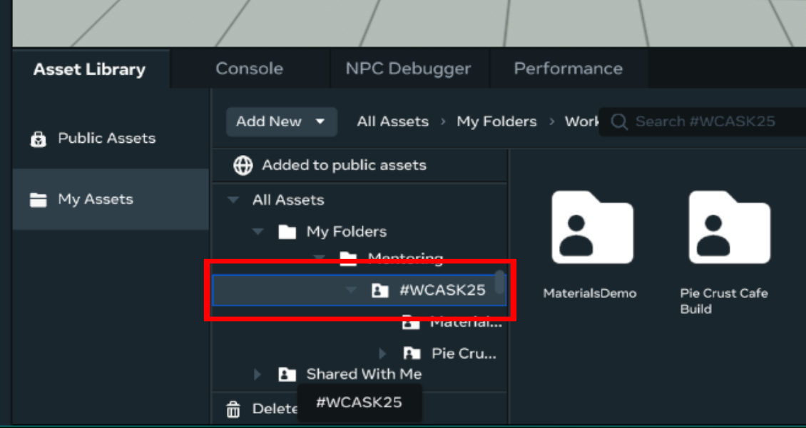
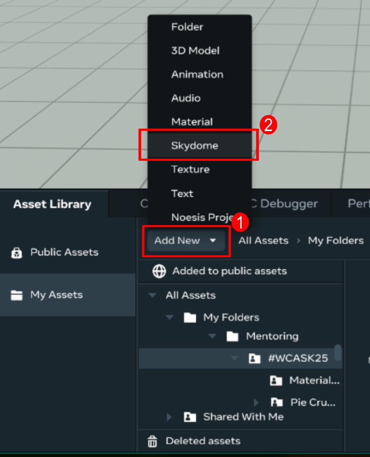
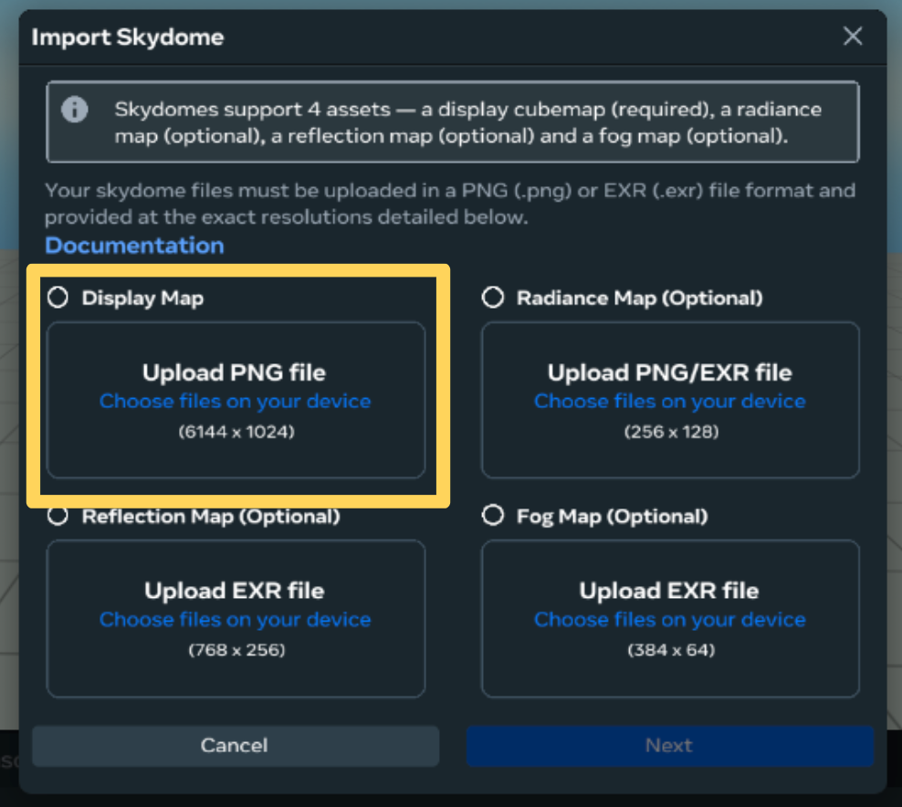
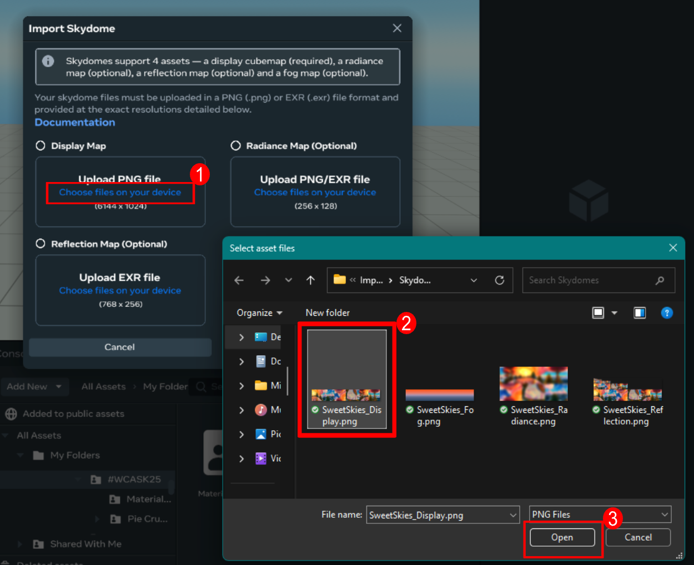
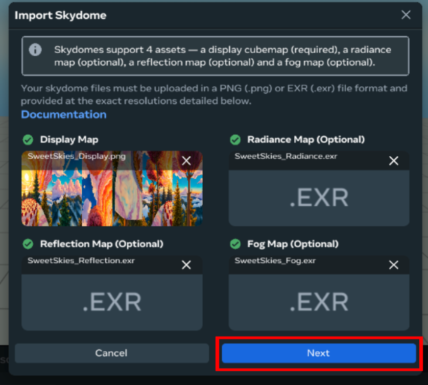
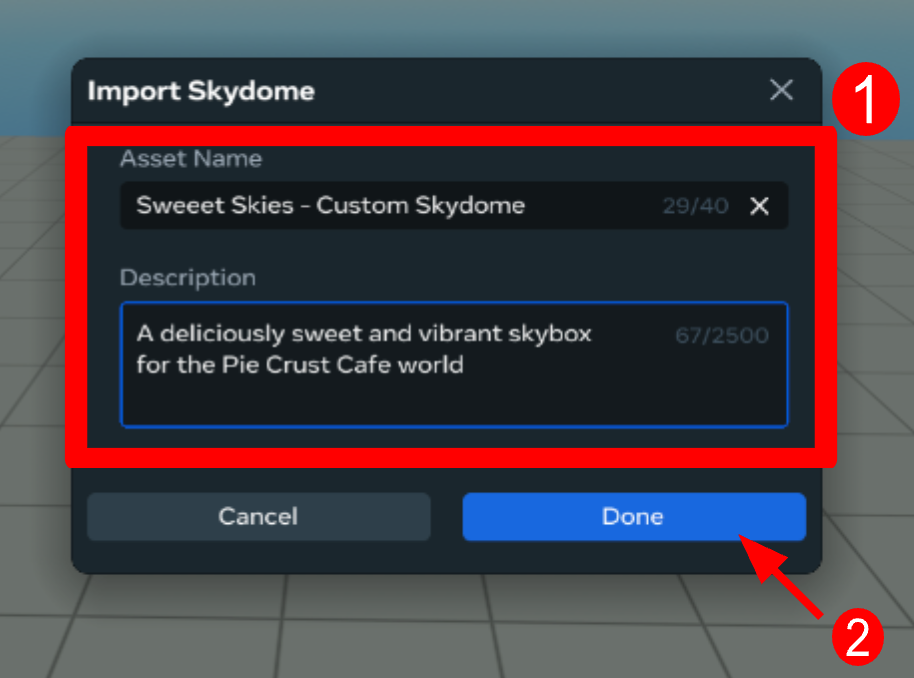
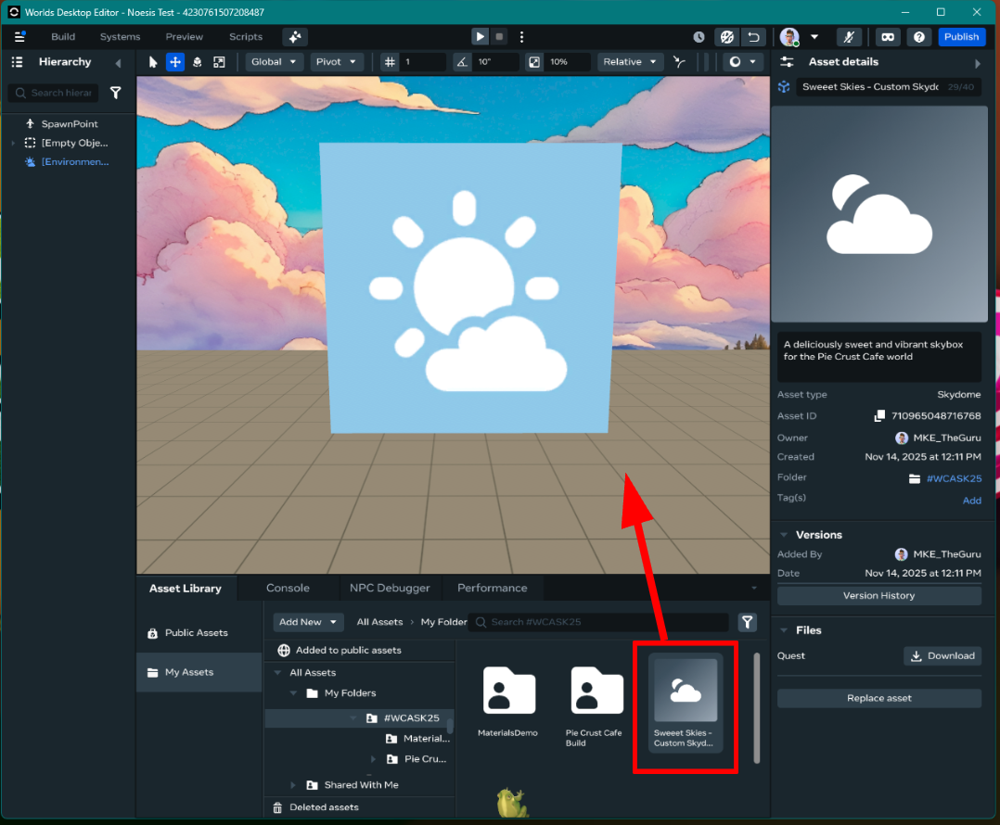

# Importing Custom Skydomes in Meta Horizon Worlds Desktop Editor

###  Related Links:
[Developer Documentation: Importing Custom Skydomes](https://developers.meta.com/horizon-worlds/learn/documentation/desktop-editor/preparing-skydome-maps-for-horizon-worlds-ingestion)
## When to use:
*Use this when you are ready to import a custom skydome to use within your world*
To upload a custom skydome in edit mode: 
1. Open the **Asset Library** and select **My Assets**\

3. **Select the folder** where you want to save your asset\

4. Click **Add New** and select **Skydome**\

5. **Note:** **Custom skydomes have 4 components**. **The** **Display Map is the only component that is NOT optional**\

6. For each map you wish to upload, select **Choose files on your device**, then **select the map’s file** in the file browser popup window, then **press Open**\

7. When all desired maps have been added, **press Next**\

8. **Provide a name and description** for the skydome asset, then press **Done**\

9. **Click and drag the uploaded skydome into your scene**\

### You now have a custom skydome ready to use in your world\!
