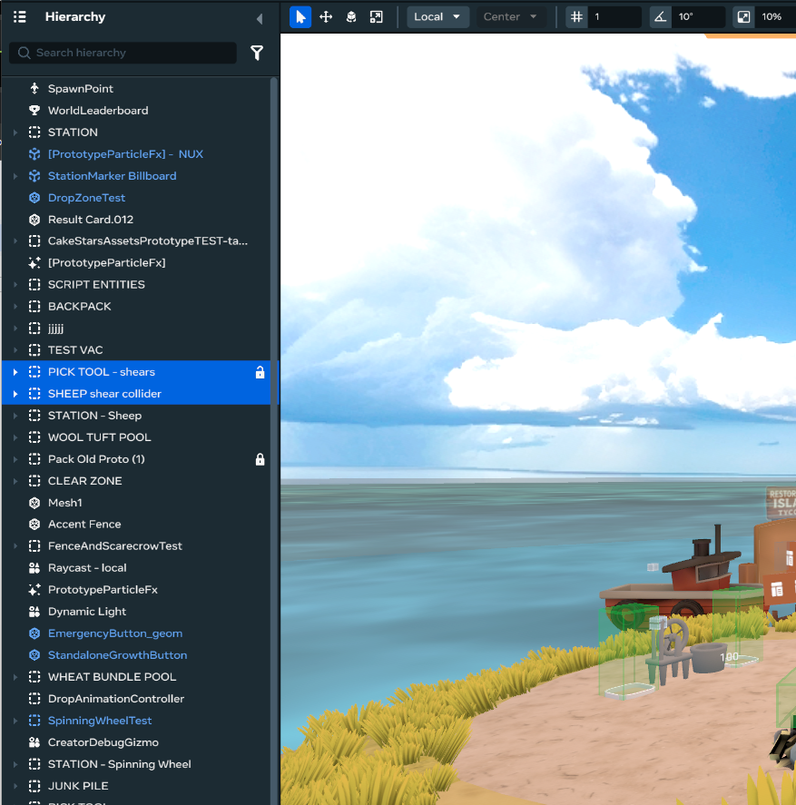
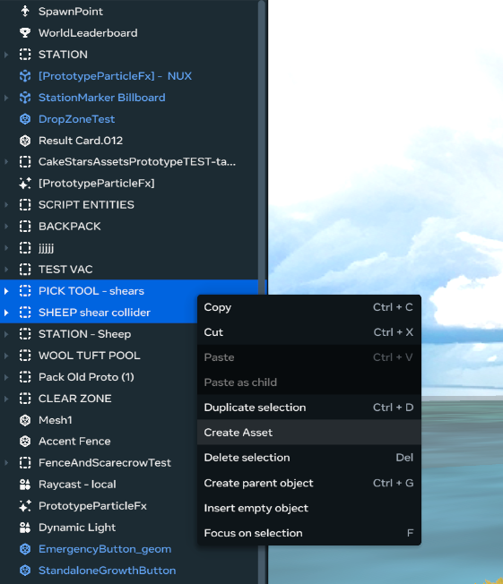
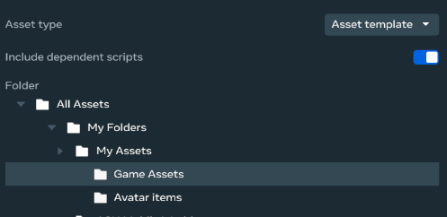
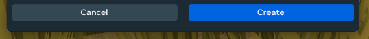
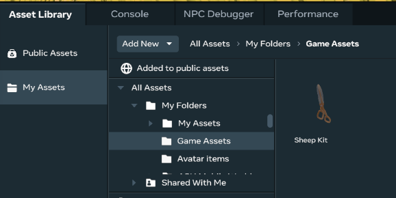

# Creating Asset Templates in Meta Horizon Worlds Desktop Editor
### Related Links:
[Developer documentation: Asset Templates](https://developers.meta.com/horizon-worlds/learn/documentation/desktop-editor/assets/asset-templates)
## When to use:
*Asset templates are useful when you want to reuse an asset multiple times in your worlds, and you want the ability to update all of the instances in one-fell-swoop.*
#### To create an asset while in edit mode: 
1. **Select** one or more **objects** **in the hierarchy window** on the left side of the desktop editor window  
   	**Tip:** Use shift + Left click  or ctrl + Left click to select multiple objects\

2. **Right click** on the selection **then** **click** **Create Asset**\

3. In the pop-up window **fill out the name and description** for your asset\

4. **Select a folder** you want the asset saved to.\

5. **Click “Create**” to save the asset.  \

6. In the bottom window of the desktop editor go to the **Asset Library** tab, then to the **My Assets** Section to find the folder you selected above and **locate your new asset**\

### You now have an asset template that you can reuse and update instances in one place!