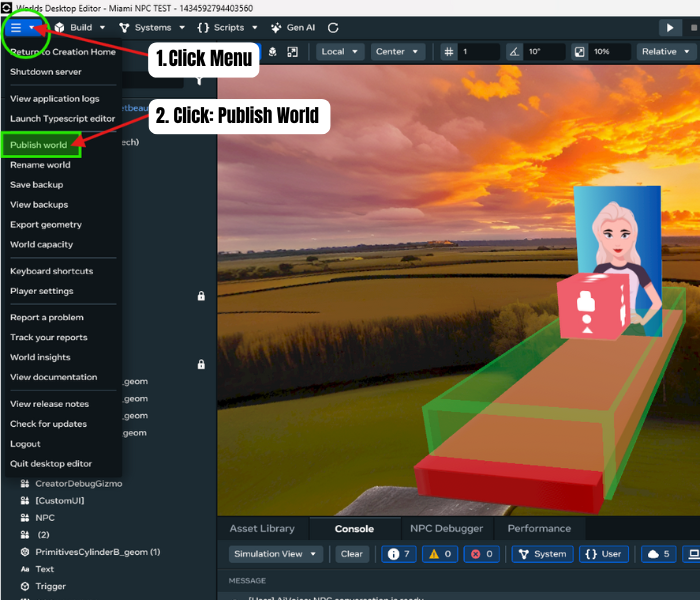
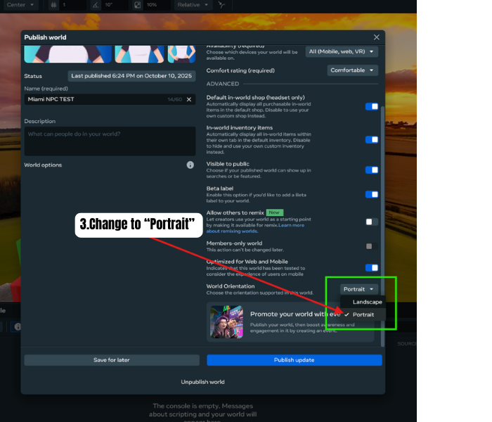
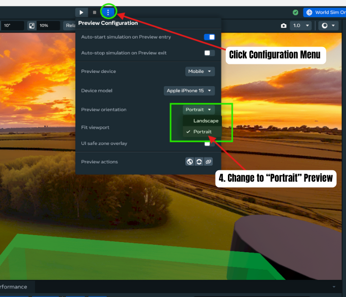
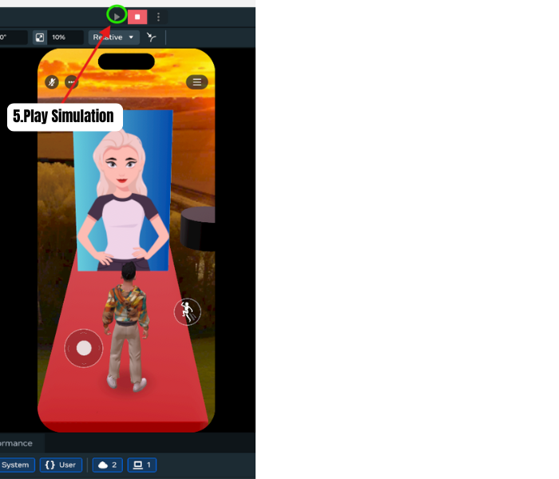

# Portrait Mode Setup in Meta Horizon Worlds Desktop Editor
### Related Links:
[Developer documentation: Portrait Mode](https://developers.meta.com/horizon-worlds/learn/documentation/typescript/api-references-and-examples/portrait-camera-api)
## When to use:
 When you would like to create a portrait style Mobile World/Game. 
### Benefits:
  **\-** System Menu & Player Inputs are adjusted for Portrait Style Design  
### Steps:
1. Click on “Menu” Icon in Top Left Corner of Desktop Editor 
2. Click On “Publish World”\

3. Change to “Portrait” for World Orientation\

4. Preview Steps\

5. Start/Play Simulation\
