# Creating Avatar Clothing in Meta Horizon Developer Dashboard

### Related Links:
* [Avatar Clothing Creation and Selling](https://developers.meta.com/horizon-worlds/learn/documentation/full-bodied-avatars/avatar-clothing-creation-and-selling)

### When to use:
To create avatar wearables and setting a commerce system in your world

### Benefits:
It creates a fun interaction that is easy to implement and doesn’t require scripting.

1. Go to developer dashboard
2. Go to Digital Items \
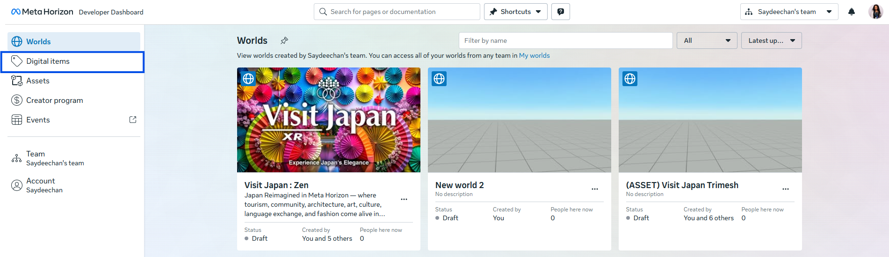
3. Go to Create Avatar Item \
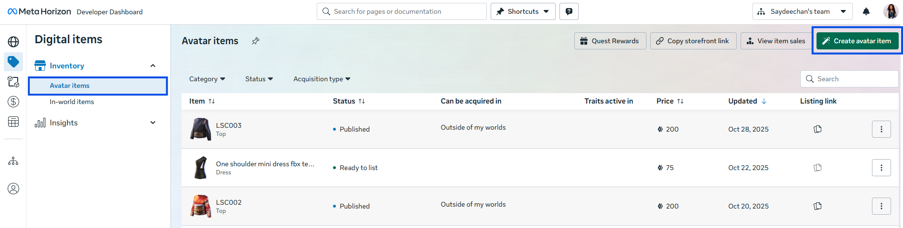
4. Pick a template \
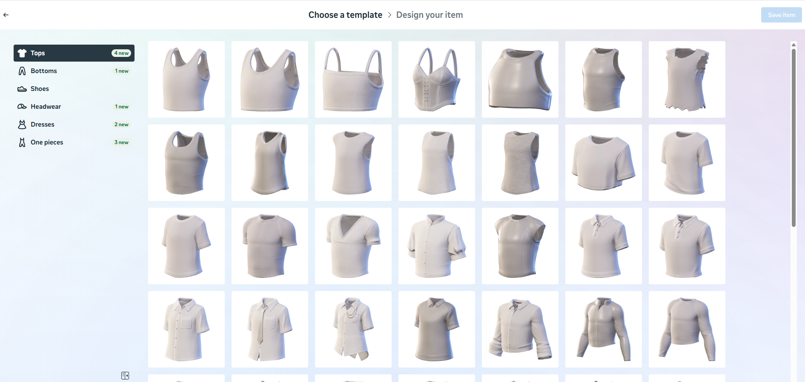
5. Download Design Files \
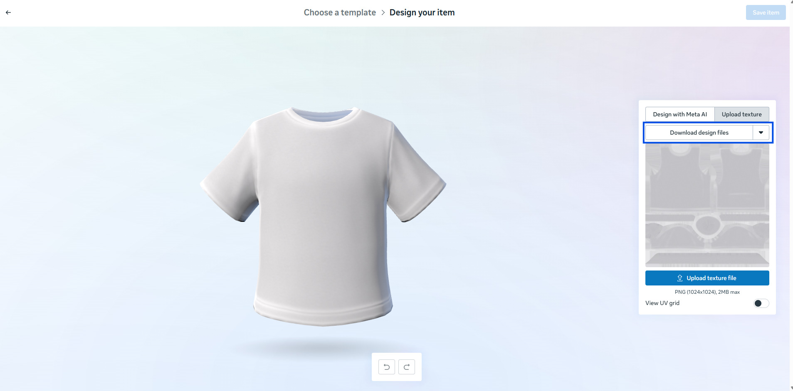 \
Specification: PNG 1024x1024 (2 MB Max)
6. Use the texture map and UVguide as a reference to start designing.\
Texture Map \
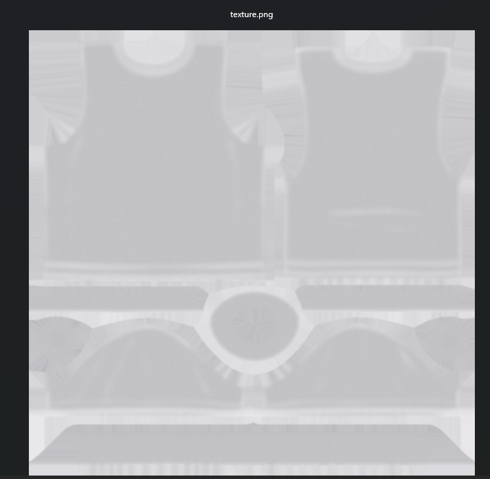 \
UV Guide \

### 2D Designing Demo using Canva
                
Using UV Guide and Texture map to determine placement \
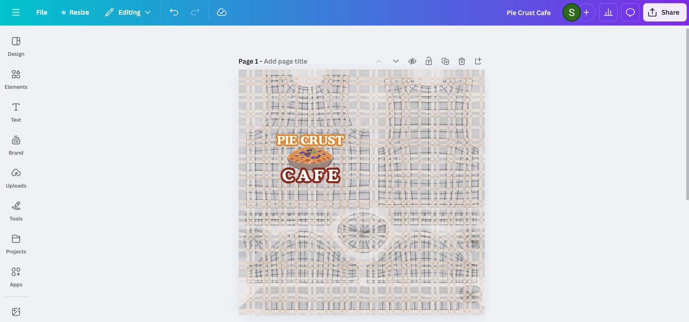

Removing the UV Guide and Texture Map for final design ready to download \
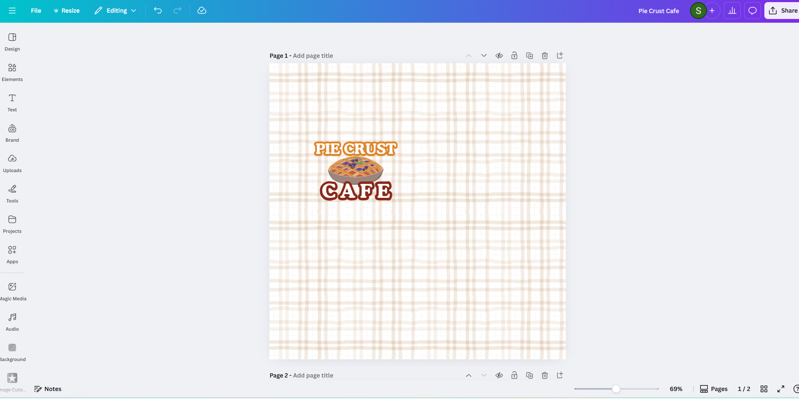
Final Texture design file
(1024 x 1024 under 2MB)

### Bringing your design into Meta Horizon

1. Upload texture \
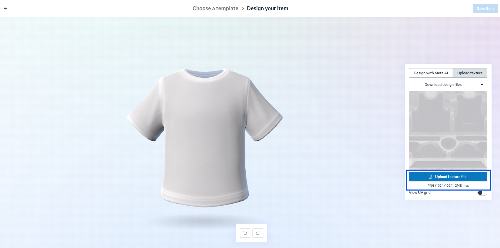
2. Review and adjust your design as needed
3. Save Item \
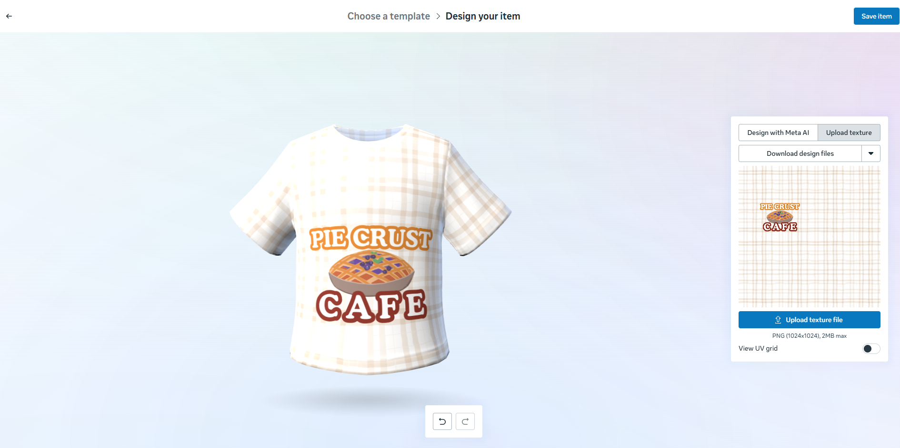
4. Set Listing Details \
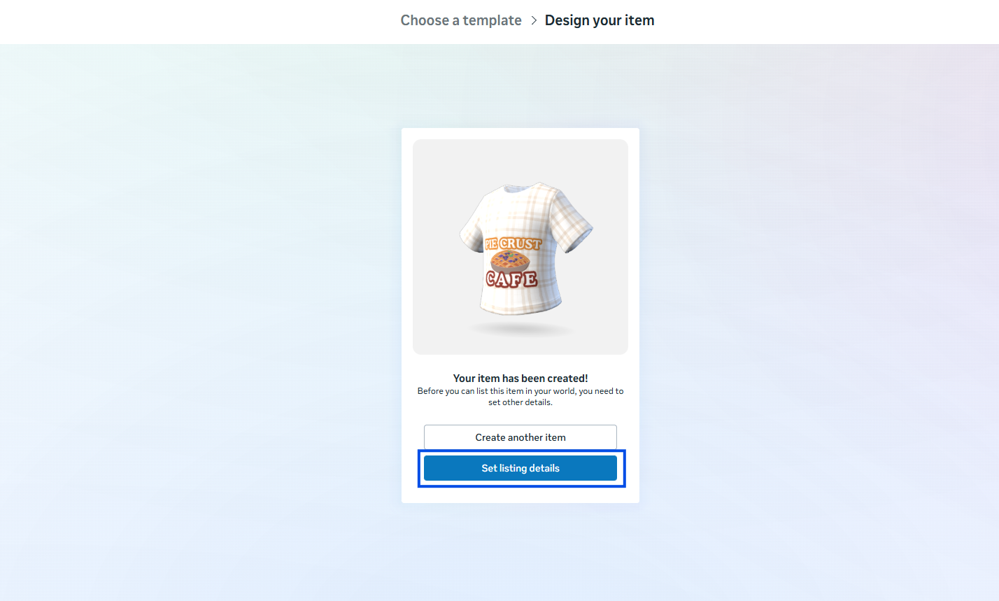\

5. Open Desktop Editor \
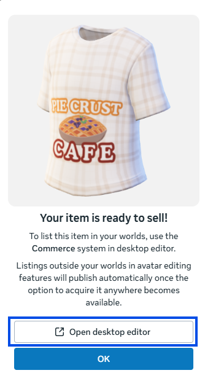
6. Go to your asset library, and find “Avatar Items”
7. Drag and drop the asset into the world \
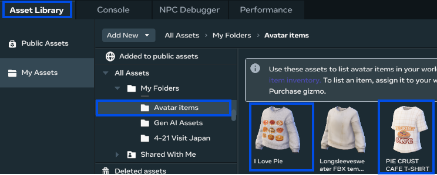

### Setting up Commerce system in your world

1. Go to system -> Commerce
2. Click the “+” button and select “Add avatar item” \
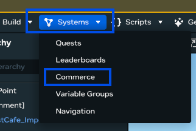 \
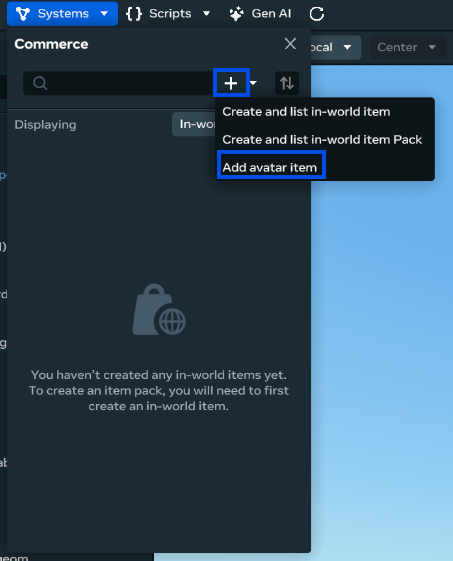
3. Select your wearable asset
4. Click Add \
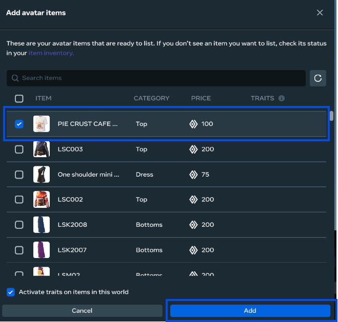
5. You will see the items you added under the commerce avatar item list. \
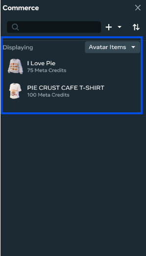\
**Important!: You must be the world owner to set up a commerce system for avatars clothing.**
6. Go to “Build” on the top-left menu and select “Gizmo” \
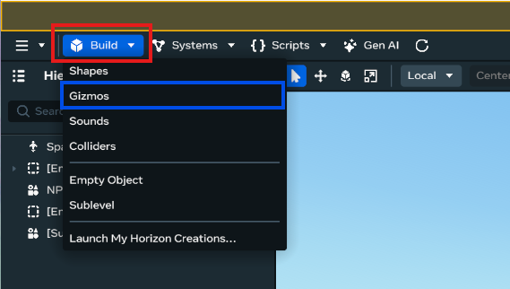
7. Select “In-world purchase” Gizmo and drag it into the world \
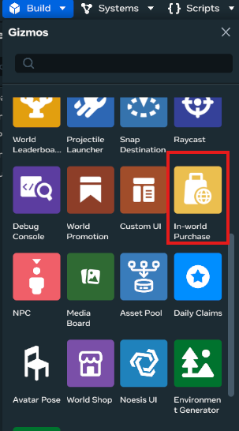
8. Click the yellow box (In-world Purchase Gizmo) \
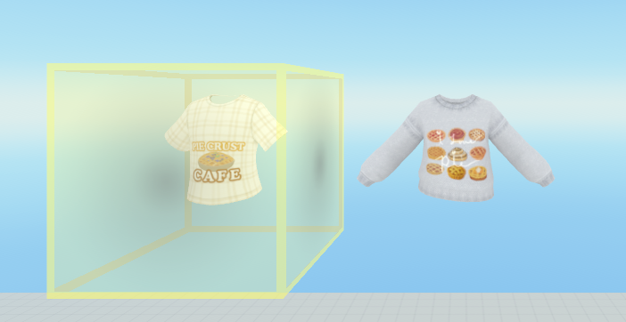
9. Go to the property setting on the right on the desk top editor
10. Go to select item, and choose the item you would like to set up to sell. \

11. Go to UI Property and choose how you would like your In-world purchase to display. \
	- Trigger - UI will pop up when player gets close to the item \
	- Button -  A button with a cost displaying \
	- Icon - a button with no cost displaying. \
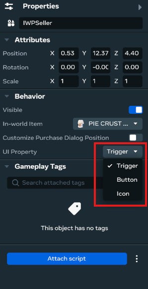

#### You are all set and ready to sell your clothes!

## How to export 3D Avatar Clothing in Meta Horizon Developer Dashboard

1. Follow steps 1-4
2. Upload a blank or any texture (step 1 on Bringing your design into Meta Horizon)
3. Go to your asset library and “My Asset” \
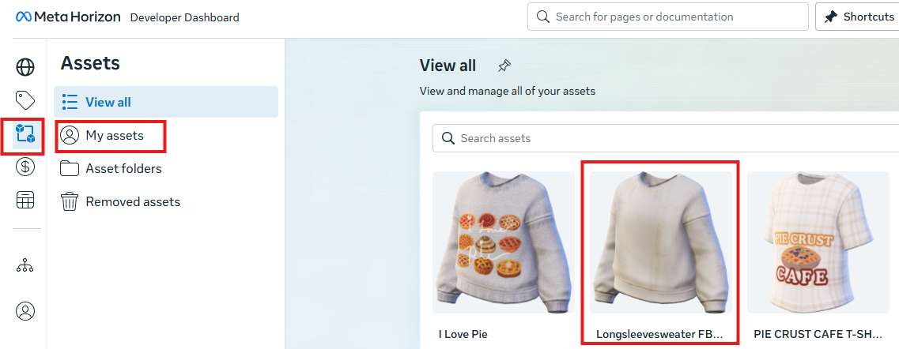
4. Click on the asset and a small window will pop up.
5. Scroll down and find “Files” and click on “ Download” next to “ source” \
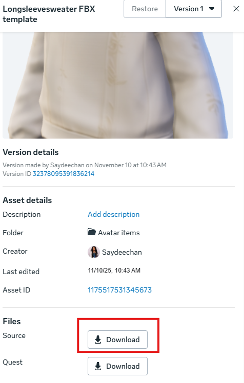
6. Go to the file where the file was downloaded.\
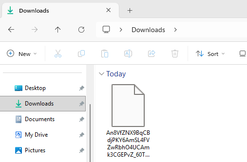
7. Right click and “Rename” \
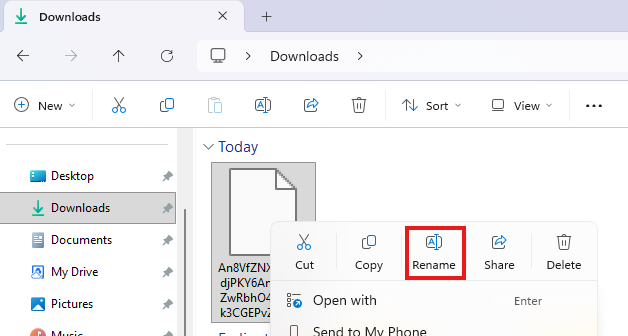
8. Rename your file to “anyfilename.fbx” \
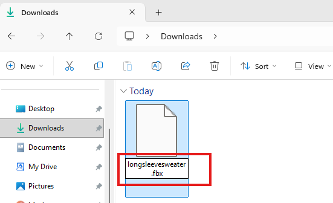
9. Now you have the ability to import this file into any 3D software that is compatible with FBX file.

**The Procreate app on iPad only accepts OBJ file. Use a FBX to OBJ converter, or use Blender and import the FBX file, then export as a OBJ file.** 

[Free FBX to OBJ Converter Website](https://imagetostl.com/convert/file/fbx/to/obj)

You can now import the OBJ file into Procreate and begin painting directly on a 3D model. \
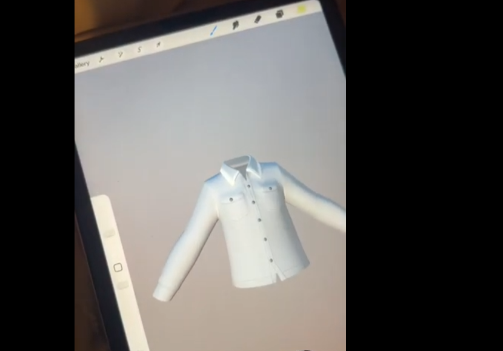
