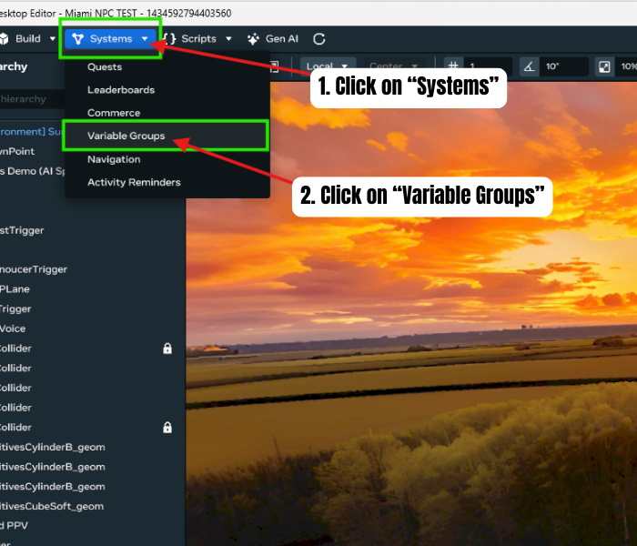
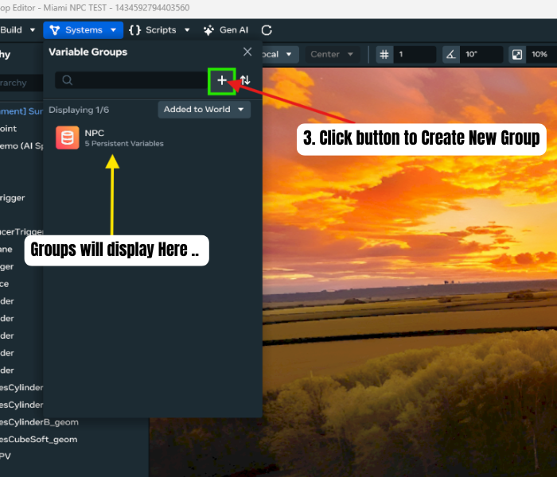
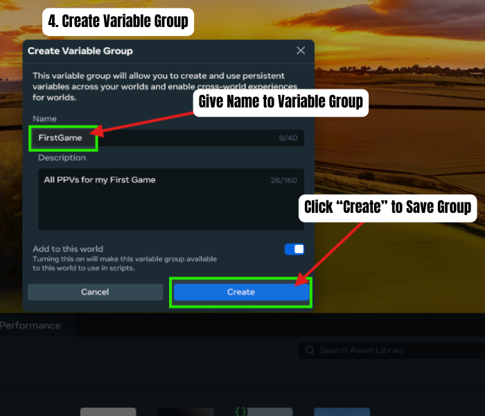
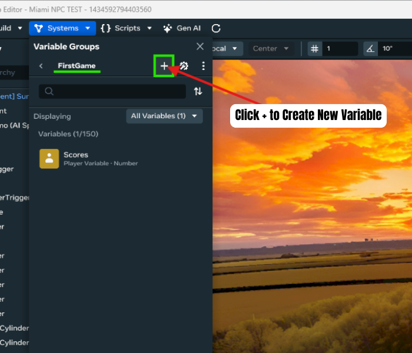
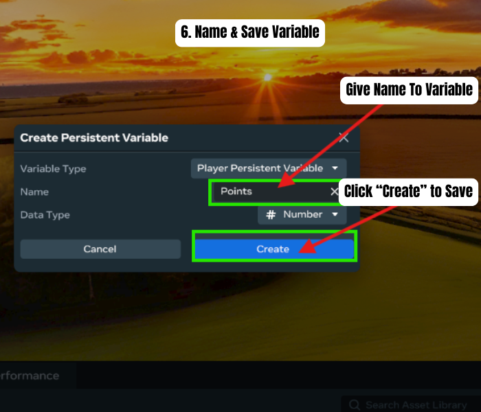
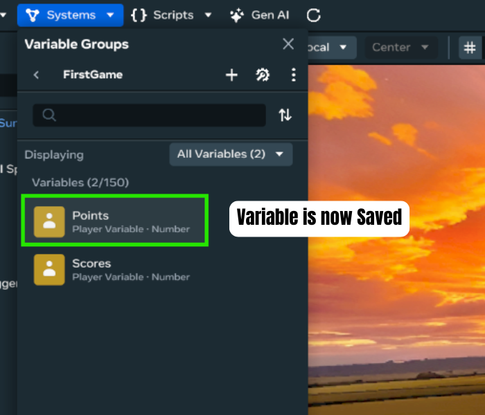

# Player Persistent Variables in Meta Horizon Worlds Desktop Editor
### Related Links:
[Developer documentation: Persistent Variables](https://developers.meta.com/horizon-worlds/learn/documentation/typescript/getting-started/persistent-variables-v2)
## When to use:
To Save Data for a player such as Scores, Points, Progression and Currency 
## Steps:
1. Click on “Systems” button on Top Left of Desktop Editor
2. Click On “Variable Groups” \

3. Click “+” to Add/Create New Variable Group to World \

4. Create Variable Group \

5. Click “+” to Create New Variable \

6. Name & Save Variable \

7. Done\! Now Implement in Typescript \
