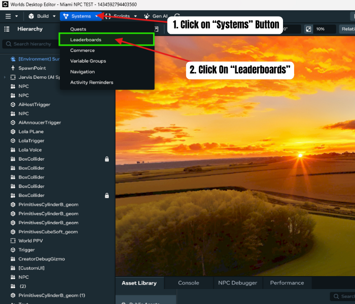
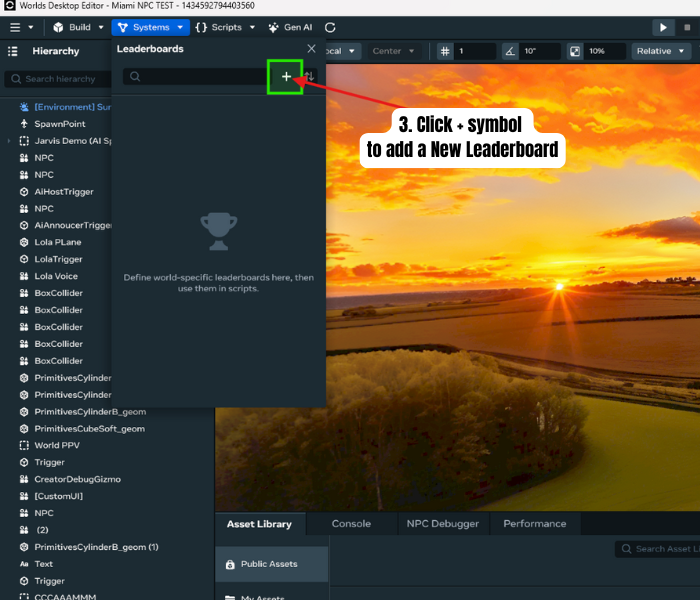
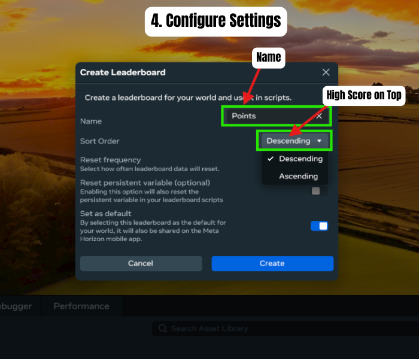
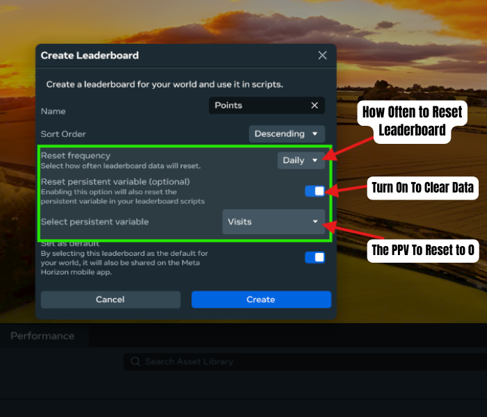
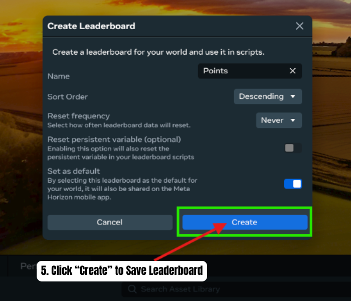
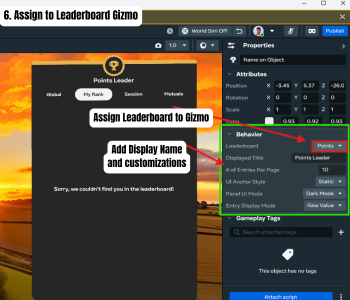
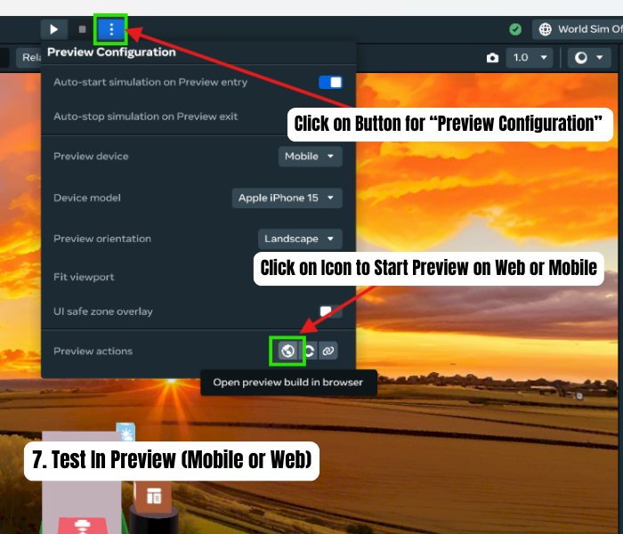

# Leaderboard Setup in Meta Horizon Worlds Desktop Editor
### Related Links:
[Developer documentation: Leaderboards](https://developers.meta.com/horizon-worlds/learn/documentation/desktop-editor/quests-leaderboards-and-variable-groups/showing-leaderboards-in-the-meta-horizon-app)
## When to use:
 To Display Saved Player Data such as Scores, Visits, Points etc
## Steps:\
Outlined..
1. Click on “Systems” Button on Top/Left of Desktop Editor
2. Click On “Leaderboards” \

3. Click “+” symbol to Create a New Leaderboard \

4. Configure Settings \
\
**OPTIONAL Automatic Reset Data**\

5. Save “Create” Leaderboard \

6. Assign to a Leaderboard Gizmo \
 
7. Test and Note: (Does not Display Data in Desktop Editor) \
