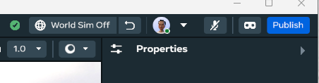
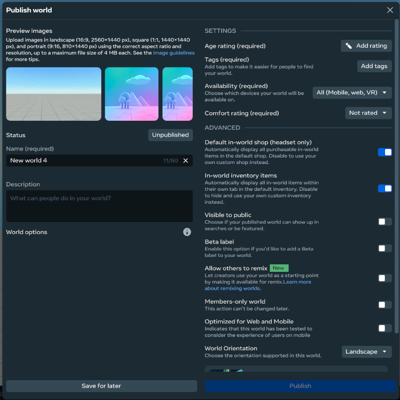
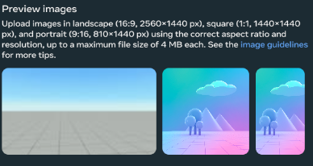
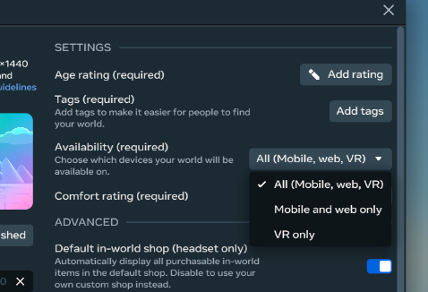
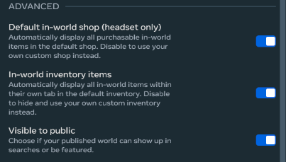
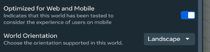
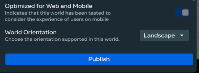
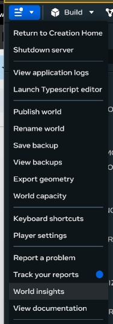
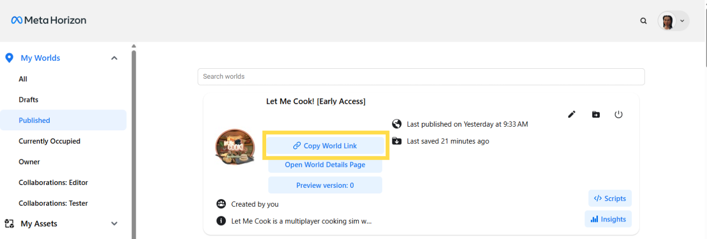

# Publishing A World For Mobile in Meta Horizon Worlds Desktop Editor
### Related Links:
* [Developer documentation: Publishing worlds on mobile](https://developers.meta.com/horizon-worlds/learn/documentation/create-for-web-and-mobile/publishing-worlds-on-mobile)  
* [World preview image design guidelines](https://developers.meta.com/horizon-worlds/learn/documentation/save-optimize-and-publish/world-preview-image-design-guidelines)
## When to use:   
Publishing a world optimized for mobile indicates to players that the world has been tested to consider the experience of users on mobile.
### To publish a mobile world while in edit mode: 
1. **Click ‘Publish”** found in the upper right hand corner or in the main menu dropdown of the editor \
 \

2. **Fill out** the required text boxes and required *Settings* section  
   **Tip:** A description though not required helps players know about your game before visiting \

3. **Upload 3 images** for your world in 9:16, 1:1 and 16:9 as key art for your world page, thumbnail and portal \

4. In the *Settings* section, for the ***Availability*** **dropdown** make sure to **select an option that includes mobile**. \

5. In the *Advanced* section, to make the world visible to player make sure you **turn on Visible to public** \

6. Towards the bottom of the *Advanced* section, **turn on Optimized for Web and Mobile**, to let players know the experience has been created with mobile users in mind  
   **Tip:** If greyout out and not turned on, check that you selected an option that included “mobile” in step 3 when selecting "Availability" \

7. **Click “Publish**” to make your world live.   
   **Tip:** You can click “Save for later” instead if you want to pre-fill the necessary information and publish later \

## You now have a published mobile world!
### Bonus Step:
Click **World Insights** to be taken to the creator page where you can get a link to your world \
 \
