# Lighting Your World Like a Pro - A Step-by-Step Process

### Tutorial created by Lauren Schroeder (virtualpebble)

#### **Last Updated**: September 10th 2025

World lighting is often treated as an afterthought, but it’s one of the most powerful tools you have to shape mood, guide players, and add realism to your world.

Lighting is like background music at a party. If it’s good, nobody notices, but if it’s bad, *everyone notices*. Visitors won’t always clock each specific lamp or glow, but they’ll feel its influence.  

Good lighting quietly influences how players move, explore, and experience your world. Using the Environment Gizmo can give you a good baseline for nice ambient lighting, but we can get more control with additional methods.

In this tutorial, you’ll learn a step-by-step process for lighting your worlds. It’s the same approach professional lighting designers use in animation, games, and theatre [(see the References if you want to nerd out)](#references), but adapted here for Horizon Worlds.

You can follow along with the process by watching the video here:

<iframe width="560" height="315" src="https://www.youtube.com/embed/ezQdoJHgrQg?si=P9A673c346UrQ7H9" title="YouTube video player" frameborder="0" allow="accelerometer; autoplay; clipboard-write; encrypted-media; gyroscope; picture-in-picture; web-share" referrerpolicy="strict-origin-when-cross-origin" allowfullscreen></iframe>

### Prerequisites
- You should have the Horizon desktop editor installed
- You should have basic familiarity with the light and environment gizmos. We'll be focused more on lighting process than gizmo specifics, but will share enough tips to help you follow along either way.

## Contents

1. [Core Lighting Concepts](#core-lighting-concepts)
2. [Styles of Lights](#styles-of-lights)  
   - [Key Light](#1-key-light---turns-out-the-sun-is-really-bright)  
   - [Fill Light](#2-fill-light---softening-your-scene-and-filling-in-the-gaps)  
   - [Area Lights](#3-area-lights---big-soft-lights)  
   - [Practical Lights](#4-practical-lights---real-lightbulbs-neon-signs)  
   - [Volumetric Lights](#5-volumetric-lights---light-as-a-dramatic-object)  
   - [Spotlights](#6-spotlights---lots-of-control-big-performance-cost)  
   - [Rim Lights](#7-rim-lights---outlining-the-star-of-the-show)  
3. [How Lighting Solves Practical Problems](#how-lighting-solves-practical-problems)  
4. [Shadows](#shadows)  
5. [Color](#color)  
6. [The Process to Light a Scene](#the-process-to-light-a-scene)  
7. [Case Study: Daytime Forest](#case-study-daytime-forest)  
8. [References](#references)


### Core Lighting Concepts

This section introduces the universal roles of light. These concepts came from theatre, film, and animation industries. 

## Styles of Lights

### 1. Key Light - *Turns out, the sun is really bright!*
    
The key light is the main source of lighting in your scene, which is often the sun or the moon. If you’re indoors, it might be a lamp, or sunlight streaming through the window. It shines across the world in one direction, casting shadows around the scene.

In Horizon Worlds, this can be simulated with an area light, casting soft shadows. These images show how the different sunlight colors affect a scene in Horizon Worlds. Each image includes the time of day and sample RGB color values ( 0-1)[¹](#references) used for the lighting.

| Sun at Noon | Sun through Clouds/Haze | Sun at Sunrise/Sunset |
|------------|------------------------|---------------------|
| 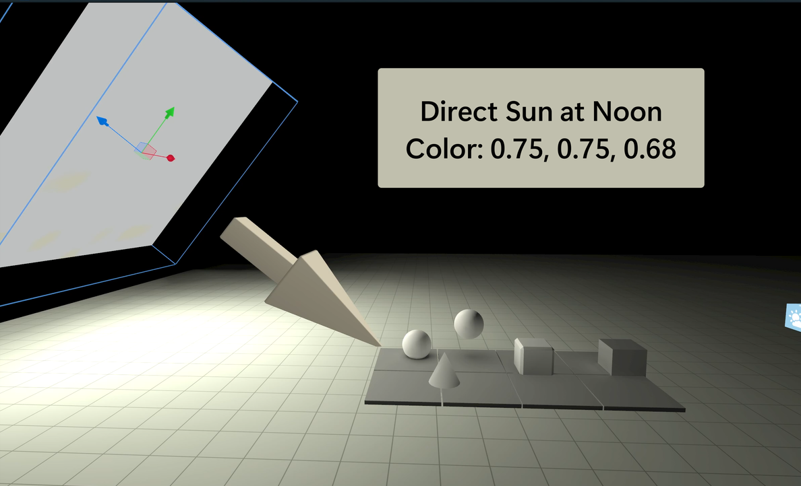 | 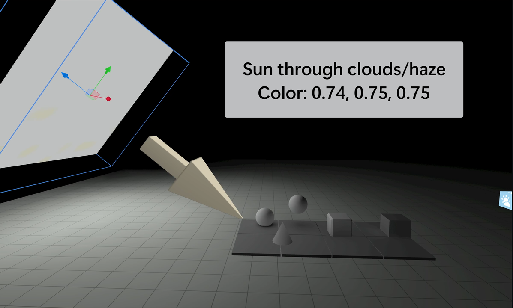 | 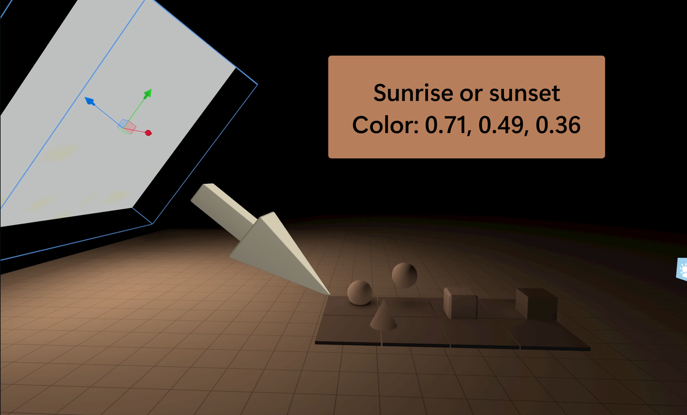 |

*Copy & Paste parameter values for these sun examples:*
```horizon
Light Type: Static Light Gizmo
Position: hz.Vec3(2.05338,7.081791,23.6154251)
Rotation: hz.Vec3(320.8052,0.000001982932,-0.00000556952637)
Scale: hz.Vec3(10,10,10)
Shape: Rectangle
Intensity: 20.00
```
### 2. Fill Light - *Softening your scene and filling in the gaps*

The fill light complements the key light. It fills in the dark parts of the rest of the scene, and reduces harsh lighting contrast. It tones down the drama.

*Fun Fact: This difference between the lightest and darkest parts of your scene is also known as key to fill ratio.*


In Horizon, we can use the **Environment Gizmo** to let Sky Domes function as a fill light. These unique light sources surround and provide light from all around your scene. They simulate light from the sky and can work well as a fill light.

I added a fill light to the 'Sunrise/Sunset' scene from above. Notice how it reduces some of the harsh shadows, giving this scene a more soft and natural look.

| Only the Sun Key Light | After the Fill Light is Added | Environment Gizmo Settings |
|------------|------------------------|---------------------|
|  | 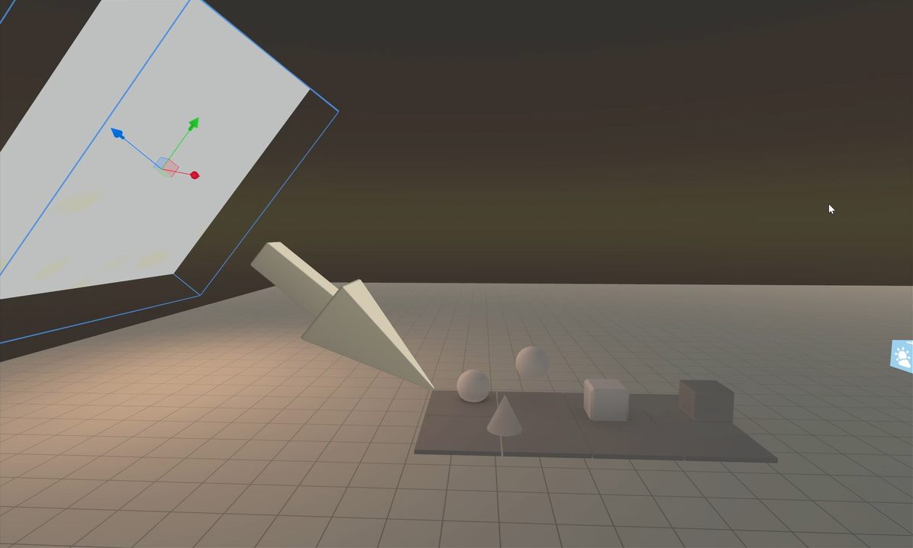 | 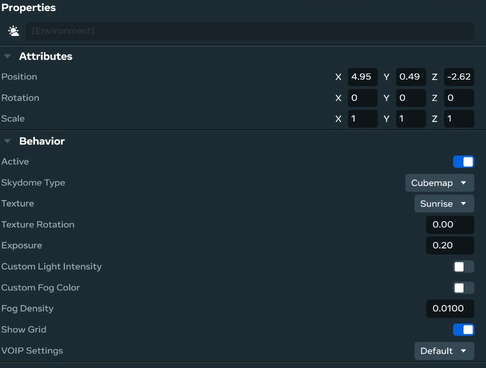 |


*Want to dig deeper? By using a Cubemap or Custom Gradient, the colors from these images are used to determine the brightness and color of light from each angle. This technique is known as Image Based Lighting (IBL).*

### 3. Area Lights - Big, Soft Lights
Area lights are represented by a 2D plane and they give us soft light, and soft shadows. They are often used to represent large fluorescent lights or television screens. They may add a secondary layer of shadows to your scene.

These can be represented by the Static Light Gizmo with Rectangular or Disk shape. Choose the shape that best represents the object the area light is simulating and scale it as needed.

### 4. Practical Lights - *REAL lightbulbs, neon signs*

Practical light sources are visible as 3D models in your world. This may include street lamps, neon signs, or candles.

In Horizon, these can usually be simulated with a static point light. You may need to use multiple lights with your model. For example, a lamp may have a soft glow through the lamp shade, as well as a disk aimed out of the bottom of the lamp.

| Lamp Ellipsoid Static Gizmo|  Lamp Ellipsoid Static Gizmo | 
|------------|------------------------|
| Light shining on lower and upper parts of lamp |  Light mostly shining downwards | 
| 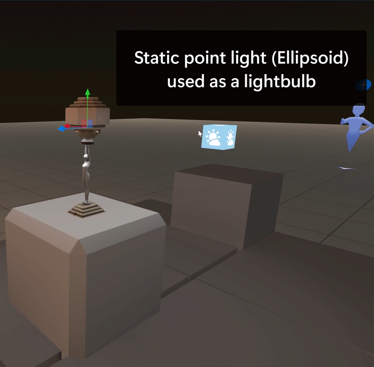 | 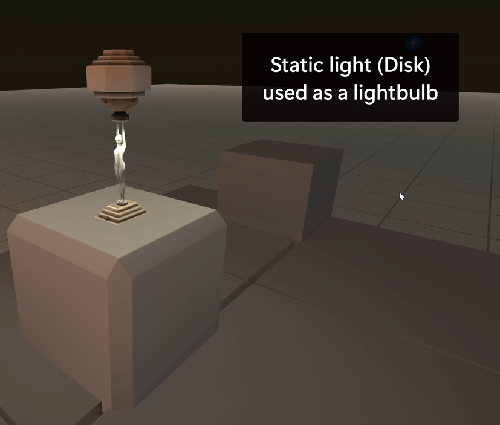 |

*Copy & Paste parameter values for the disk static light*
```horizon
Light Type: Static Light Gizmo
Placement: Inside lamp
Scale: hz.Vec3(0.3,0.3,0.3)
Rotation: hz.Vec3(273.154175,-0.000117301133,0.00012394326)
Scale: hz.Vec3(10,10,10)
Shape: Disk
Color: hz.Vec3(0.933333337,0.8862745,0.7294118)
Intensity: 20.00
```

### 5. Volumetric Lights - *Light as a (dramatic) object*

This refers to lights that are very visible, as they pass through dust, fog, or water. So visible, they almost look like 'objects' of light. They can add drama to a scene.

These can be created using Horizon's masked blend materials to make conical spotlights or rays. Adding a Static Light (disk shaped for a spotlight) adds extra realism to the volumetric light.

| Adding a Mesh and Static Light| Experiment with different Static Light intensities | 
|------------|------------------------|
| 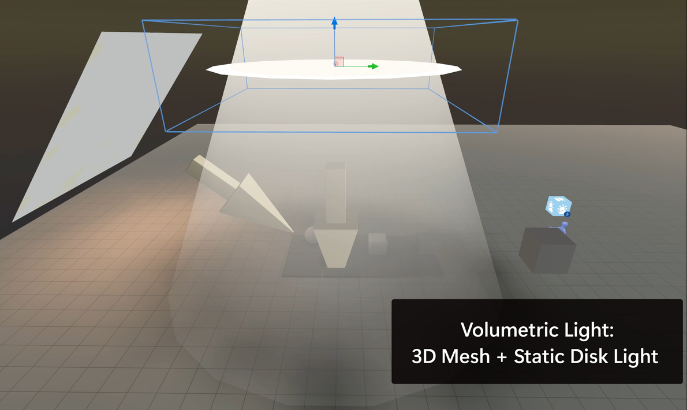 | 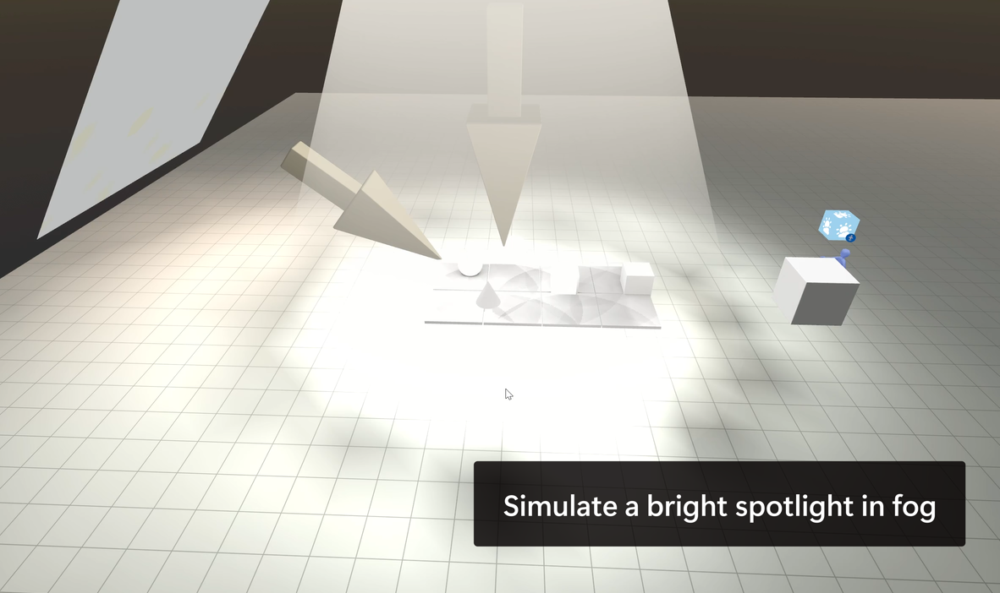 |

```horizon
Mesh: Cone Light by Josh_isFine_For_Now
Asset ID: 1334691421069568
```

### 6. Spotlights - *Lots of control, big performance cost*

These cone-shaped light give you the most control over light size and shape. 

In Horizon, these can be setup using a Dynamic Light gizmo and choosing the spread to finetune the size of the spotlight. 

It’s a dynamic light though, so should be used sparingly as it has a larger performance cost. They don't cast shadows and they're best used when you need a moving light, such as with spotlights or flashlights. You cannot have more than 10 dynamic lights in your scene.

| Large Spotlight - Spread of 60 | Large Spotlight - Spread of 30 | Smaller Spotlight - Spread of 30 and closer to object |
|------------|------------------------|---------------------|
| 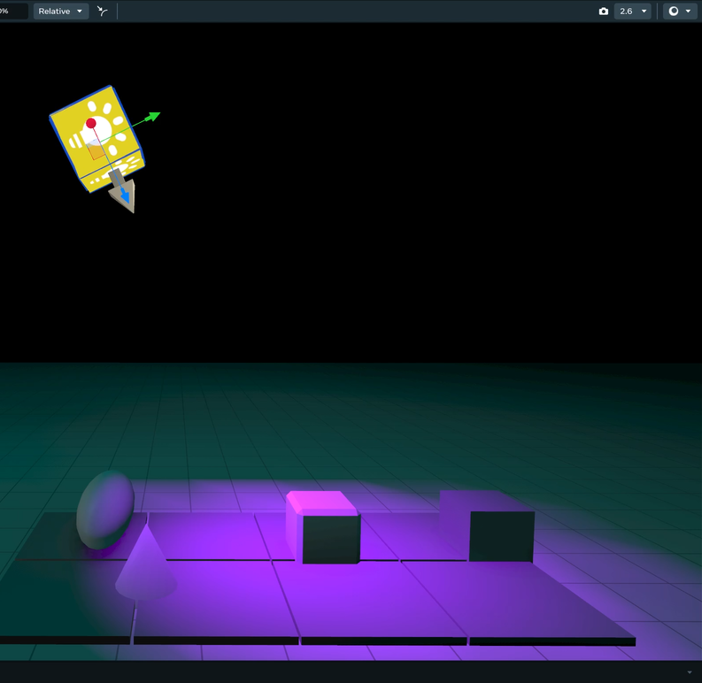 | 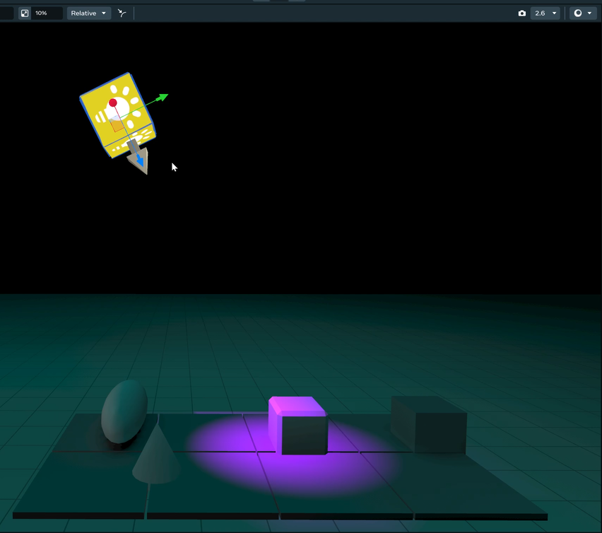 | 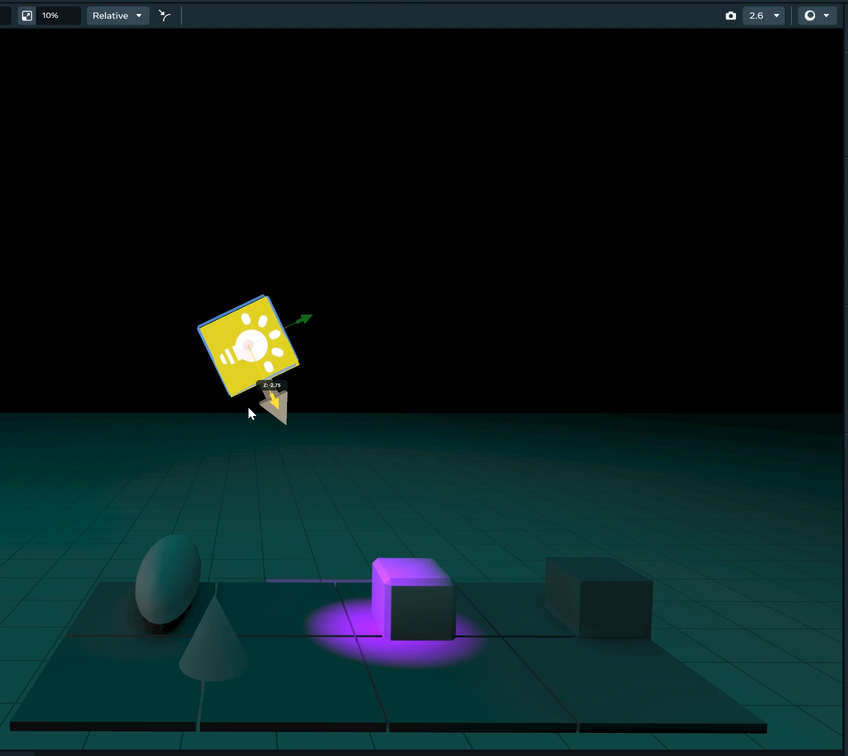 |


### 7. Rim Lights - *Outlining the star of the show*

Rim lights are positioned behind the subject and give them a glow that helps to separate the subject from the background. This is a less realistic light, and is typically used for specific angles or shots when filming. It's less applicable in games but we'll include it in our case study later.

## How Lighting Solves Practical Problems

Beyond setting the mood of your world, lighting can be a useful tool in many ways.

- Integrating Elements
    - Your mismatched assets suddenly look like they belong together. This is especially useful with strange worlds where you have something like a tiger in an underwater cave. Lighting pulls everything together.
- Defining Spatial Relationships.
    - Shadows help us to see exactly where the object is located. Players know where to jump to collect a floating coin!
- Shaping
    - By adding shadows onto crevices and surfaces of objects, lights and shadows help us to see details of an object, rather than washing it out as a big blob.
- Pathing
    - Do you have a huge forest environment, where people need to find special objects? Using lights as a glowing breadcrumb trail.

## Shadows

Shadows teach us about the light size and direction. Sharp, hard shadows mean the light source is probably small and/or far away compared to the object.

For soft shadows, we know the light source is less direct and might be large compared to the object.

Sharp shadows = harsh interrogation room.  
Soft shadows = dreamy coffee shop.  

### Technical Note:
It’s currently difficult to really fine tune shadows in Horizon, and dynamic lights do not cast shadows.
 For static light sources, it helps to have shadows fall on surfaces with higher vertices counts. Shadows are rendered based on the amount of light falling within a set of vertices, so high-poly models will show shadows more accurately.

## Color

Every light has a color, and this color affects the mood of your scene. Color contrasts can make colors pop from a scene and grab attention.  

Color can have cultural or biological connotations. 

🔴 Red = Alarm, danger, sports car energy

🟡 Yellow = Sunshine, cheerful, cozy

🔵 Blue = Calm, cold, or sad

🟢 Green = Natural, safe, or “you can eat this plant"

These connotations can be specific to cultures or individuals, but it is important to consider when analyzing a reference image and intention for the feeling of your world.


## The Process to Light a Scene

### Get reference images

The first way we can set ourselves up for success is to gather reference images for our environment. This will give us both a blueprint and a goal for lighting design. We can choose one or several images from photographs, paintings, or film. It might seem strange to use a reference photo for an animated project, but even cartoon environments are still based on real life environments.

### Add Your Lights One-by-One

We'll now add our lights one at a time. You can use this flowchart to keep track of the process. Follow the arrows to choose what to add next.

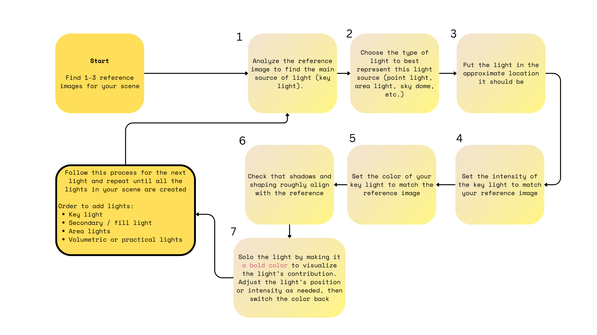

### Let's start by adding the [**key light**](#1-key-light---turns-out-the-sun-is-really-bright) of our scene. 
1. Analyze the reference image to find the main source of your light. You can look at illumination, specular highlight and shadows. 

2. Choose the type of light to best represent this light source (point light, area light, sky dome, etc.). Use [the guide above](#styles-of-lights) to help decide what to pick.

3. Put the light in the approximate location it should be. Use your reference image to see where the light seems to originate from.

4. Set the intensity of the key light to match your reference image. Consider how bright the highlights and shadows from the light look.

5. Set the color of your key light to match the reference image. Look at the color of the light in different areas of the image. You can even use a color picker tool (online or in graphics software) to reference the color values that show up in your reference image.

6. Check that the shadows and shaping roughly align with the reference. Depending on your world environment, shadows may not show up so much in your world. Don't worry too much about trying to optimize the shadows perfectly.

7. 'Solo' the light to make it easy to see. Sometimes it's difficult to understand what effect a light is having, especially when there's multiple lights in the scene. You can try turning off the rest of the lights in the world, or making the light a bold color to visualize the light’s contribution. Adjust the light’s position or intensity as needed, then unsolo the light again.

### Nice job, you've added your first light! 
### Follow this process for the next light and repeat until all the lights in your scene are created

General order to add lights:
1. [**Key light**](#1-key-light---turns-out-the-sun-is-really-bright) 
2. [**Fill light**](#2-fill-light---softening-your-scene-and-filling-in-the-gaps) 
3. [**Area lights**](#3-area-lights---big-soft-lights)
4. [**Volumetric and practical lights**](#4-practical-lights---real-lightbulbs-neon-signs)

Each light should be positioned with the same care as the key light. Does the light look similar to the light in the reference image? Does intensity and color look good?

## Case Study: Daytime Forest

We will implement our process for this scene, feel free to reference the chart and follow along.

I used the Horizon Environment AI Generator to create a forest scene. I chose a dreamy forest with light shining down as my reference image.


### First Light: Key Light

1. Our main source of the light is definitely the sun streaming down through the center of the trees.

2. This sunlight is strong and directional. It's casting shadows and we see a contrast in lighting from the deeper forest and the opening. I'll choose a directional static light, and use either the Disk or Rectangular shape.

    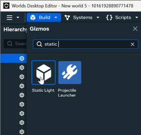

3. Now we position the key light. I'm putting it in the sky above the trees. To simulate the hole in the canopy from the reference, I'm having this light only take up a small area of the sky. This way, we can have contrast in our lighting.

    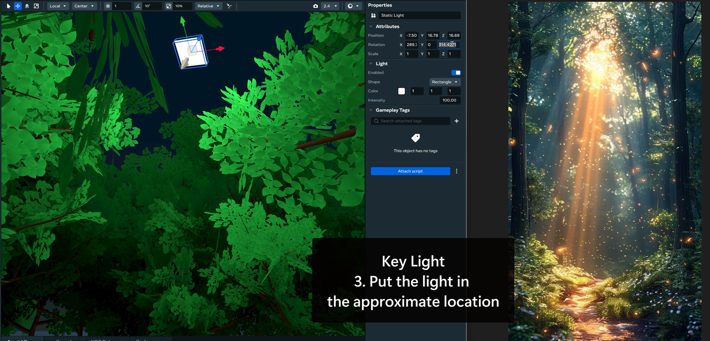

4. We set the intensity of my key light really high in order to get as much contrast as possible.

    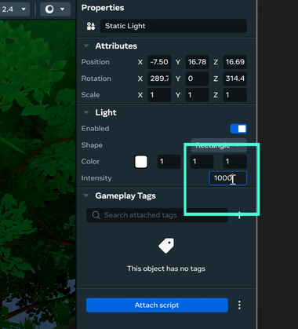

5. We set the color of my key light to yellow. The reference shows an unnaturally bright shade of yellow, which we will match in order to get more of a cheerful, stylized look.

    

6. By focusing on one bright key light, we've achieved a sense of shadow and contrast in our forest. While the forest is currently too dark, this can be adjusted with our fill light.

    


### Second Light: Fill Light

1. In the reference image, we can see that even the dark parts of the forest aren't pitch black. We have some ambient light coming from the sky and reflections.

2. We'll use an Environment Gizmo with a Sky Dome to represent this fill light. Setting the exposure to 0 turns off the light in your scene. 
    
    *You may want to set this fill light up earlier so that you can configure your key light properties without any default lighting.*

    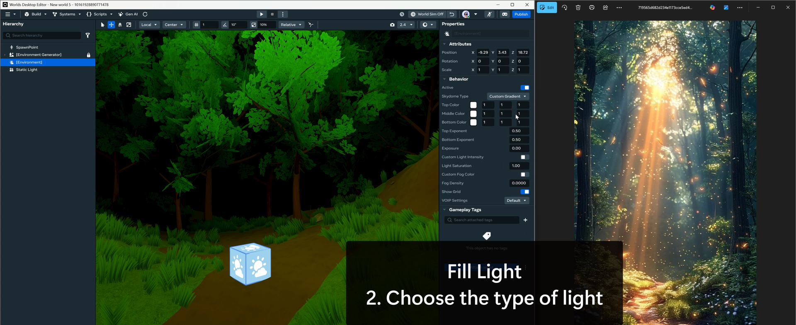


3. We don't need to position our Sky Dome, so can skip Step 3!

4. We can use our Exposure settings to change the intensity of the Sky Dome. I like to start with a value around 0.20. This usually keeps contrast with the key light without being too dark.
    ```
    Exposure: 0.20  
    Tint Color: Blue/Purple gradient  
    Tint Strength: 0.4 
     ```

    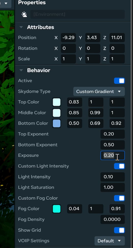


5. We set the fill color using a Custom Gradient in the skydome type, and selecting two or three different colors to use. We can change their gradients and exponents to adjust. I chose to use blue and purple cool tones to match the color of the sky I saw peeking through the trees.

    
6. I think that the contrast between our main area and the rest of the forest has improved.
    

#### At this point, you could continue on with the rest of your lights in the same way. I'll give a quick summary of how I approached the rest of the lights in the scene

### Sun Patches
I used multiple Static Lights to simulate the patches of sun coming through the trees. We don't quite have the level of complexity needed to truly simulate small shadows of leaves, so we can simulate this light pattern using small static lights. 


### Volumetric Lights
The lights streaming down from the sky would look great as volumetric lights in the scene. I started by taking the volumetric light mesh and positioning it to match the position and angle of the sun rays.
I then changed the Tint Color and Tint Strength to change match the color and opacity of the reference image.
The meshes land in the same areas I set up my sun patches, tying the scene together.


### Rim Lights
The largest tree on the left of our reference image has a rim light on the edge of it to separate it from the rest of the forest.

We can use this look by positioning a static light on our tree. I set the shape of the light to match the tree (tall and slim) and positioned it facing the edge of the tree that faces the light.

This helps to create a dramatic look and emphasizes the brightness of the sun, as well as the size of the tree.

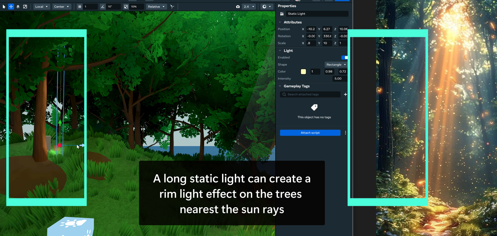

### Practical Lights (VFX)

There are tons of magical particles floating around the image. They could be leaves, magic dust, embers, it's hard to say. Either way, we can approximate these using Horizon's VFX assets.

Go to Public Assets and filter them by the VFX category. Pick which asset best matches - I chose to use the falling leaves.


In the properties menu, try changing these values until your particles look similar to your reference. Consider both static properties (e.g. color, size) as well as the movement of the particles (vertical speed, lifetime).

#### Settings I Used:
```horizon
Public Asset: Falling Leaves (VFX)
Spawn Rate: 3
Lifetime: 60
Global Scale: 1
ParticleSize: 0.3
Emitter Size: 20 / 20
Vertical Speed: 0.1 (slow float)
Color: 1, 0.67, 0.01, 1
```


### Here's what everything looks like together!
While it's difficult to get high fidelity lighting that matches a reference image, I think I was able to capture the feel of the reference. The world feels mysterious and magical. 

You can use this lighting process to start to develop a comfortable way of working with lights. As more lighting features become available in Horizon, make sure to add them to your toolbox. By understanding the fundamentals and following a process, your lighting skills will start to improve and you'll be able to create amazing ambiance.


## References

1. Birn, Jeremy. *Digital Light and Rendering*. New Riders.

*This book dives deep into lighting in computer rendering. Beyond looking at styles of lighting, it also discusses complex engine rendering techniques. This is one of the best books I found for game developers interested in lighting.*

2. Katitikarn, P. Jasmine, and Michael Tanzillo. *Lighting for Animation*. Routledge.

*A focus on lighting in animated films, with exposition on process and workflows used by artists working for Pixar. Since the focus is more on film than games, a lot of the techniques are built to consider scenes shot only from one angle. That said, there are many in-depth case studies to help understand how professionals think about lighting.*

3. Pilbrow, Richard. *Stage Lighting Design: The Art, the Craft, the Life*. Nick Hern Books.

*This book discusses lighting used in theatre, which has influenced a lot of the lighting techniques and terminology still used in computer rendering today. It’s less applicable, but good for better understanding background and techniques of lighting design.*
