# Turn ANYTHING into a Hologram with Blender Nodes

#### Tutorial created by Lauren Schroeder (virtualpebble)

#### **Last Updated**: September 10th 2025
---
### What if you could quickly transform any 3D object into a sci-fi hologram, without painting textures by hand?

### Today I’ll show you how I built the ⚡ **BLENDER HOLOGRAM ZAPPER 3000** ⚡

### This workflow shows how to use the Blender Shader Editor with Horizon’s unlit blend materials to make hologram textures. You can expand on this workflow to create your own custom textures to use in your worlds.

#### You can also follow along with the tutorial video here:

<iframe width="560" height="315" src="https://www.youtube.com/embed/TaZgO4xnnMo?si=wGRunxrF2XZ7P2BJ" title="YouTube video player" frameborder="0" allow="accelerometer; autoplay; clipboard-write; encrypted-media; gyroscope; picture-in-picture; web-share" referrerpolicy="strict-origin-when-cross-origin" allowfullscreen></iframe>

Or watch it directly on [YouTube](https://www.youtube.com/watch?v=TaZgO4xnnMo).

# Contents

- [What is a Texture?](#what-is-a-texture)
- [Why Procedural Textures?](#why-procedural-textures)
- [Materials in Horizon](#materials-in-horizon)
- [Prerequisites](#prerequisites)
- [Power Up System](#power-up)
- [Exporting a Horizon Worlds Asset](#exporting-a-horizon-worlds-asset)
  - [Bring Your Asset out of Horizon Worlds](#1-bring-your-asset-out-of-horizon-worlds)
  - [Import Your Asset to Blender](#2-import-your-asset-to-blender)
- [Getting Creative](#getting-creative)
  - [Prepare the Shader](#3-prepare-the-shader)
  - [Set up Nodes for a Hologram](#4-set-up-nodes-for-a-hologram)
  - [Tune the Style](#5-tune-the-style)
- [Bake the Texture](#6-bake-the-texture)
  - [File Name Requirements](#file-name-requirements)
- [Exporting the FBX](#exporting-the-fbx)
- [Zap your Hologram into Horizon Worlds](#zap-your-hologram-into-horizon-worlds)
  - [Color Adjustment](#color)
- [Other Fun Ideas](#other-fun-ideas)

## What is a texture?

In 3D art, a texture is an image or pattern that’s wrapped onto the surface of a 3D object to control how it looks. 

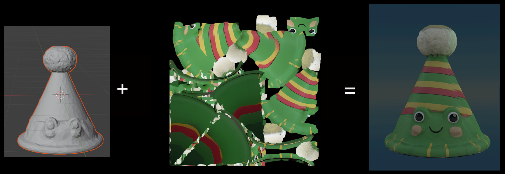  

Often, artists create textures through texture painting, where they manually paint colors and details onto the model. Instead, we’ll use **procedural textures**, which are generated using a web of logic. Think of it more like DJ’ing with visuals than painting. 

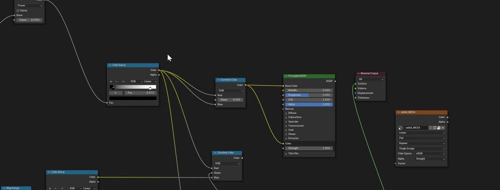  
*The shader editor inside Blender, used to generate materials*

## Why Procedural Textures?

Procedural textures are materials built with **logic and math** instead of texture painting. They're especially useful if you want consistency across many assets, or for those of us without the patience to hand-paint textures for a large world.

- **A new way to create** - You can make infinite styles with a workflow that feels both technical and playful
- **Scalable** - Apply one visual look across a whole world
- **Flexible** - Easily tweak stripes, colors, or patterns with sliders
- **Performance-friendly** - Bake your shader into a texture so it runs smoothly in Horizon Worlds

## Materials in Horizon

We’ll also take advantage of Horizon’s Unlit Blend materials: unlit, transparent AND performance-friendly materials that stay lit up in the dark. Unlike Horizon’s standard transparent materials, Unlit Blends don’t calculate light or reflections. Each pixel is simply on or off (opaque or transparent), making them much cheaper to render. That makes them a nice fit for our glowing, see-through hologram effect.

[Learn more about the types of materials in Horizon Worlds here](https://developers.meta.com/horizon-worlds/learn/documentation/custom-model-import/creating-custom-models-for-horizon-worlds/materials-guidance-and-reference-for-custom-models)

## Prerequisites

Before you start, make sure you have:
- Horizon Desktop Editor installed
- A 3D object you want to zap into a hologram (either in Horizon Worlds or exported as an FBX)
- Blender installed. I'll be using version 4.2 but any recent version should work the same way.
- Beginner experience with Blender and the Horizon Desktop Editor helps (but don’t worry, I’ll walk you through)

By the end of this tutorial, you’ll be able to:

- [Import a 3D object from Horizon Worlds into Blender](#exporting-a-horizon-worlds-asset)
- [Build a semi-transparent procedural texture ](#getting-creative)
- [Export the texture to use in Horizon Worlds](#bake-the-texture)
- [Import it into your Horizon World as a performance-friendly hologram!](#export-out-of-blender)

## Power up
Throughout this tutorial you’ll collect ⚡10 energy bolts⚡ to fully power up your BLENDER HOLOGRAM ZAPPER 3000! Learning new tools can be tough, but each completed step is powering up your skills. Collect 10 bolts and to zap your object into a hologram!

Here's your first bolt:
### ⚡ Mad Science Initiated, Bolt Collected! (1/10)

---

## Exporting a Horizon Worlds Asset

*If you already have a 3D object ready to go in Blender, you can grab TWO energy bolts ⚡⚡ and skip to [Getting Creative](#getting-creative).*

We'll start in the Horizon Desktop Editor. Horizon AI-generated objects are perfect for this tutorial. They're quick to make and since we’re replacing textures with our own hologram material, AI visual quirks won’t matter as much. [If you haven't created an AI mesh before, check out this guide.](https://developers.meta.com/horizon-worlds/learn/videos/custom-meshes-with-genai) I generated a few AI models of hearts and picked my favorite. 

  

### 1. Bring Your Asset out of Horizon Worlds

1. In Horizon, click on your asset to open your asset’s details panel on the right.
2. Scroll until you see the **Source → Download** button. This will let us download the plain 3D model (FBX). *Don't worry about the Textures, we'll be creating our own fresh hologram texture instead.*
3. Save this FBX (`.fbx`) file somewhere easy to find. 
 *I created a specific folder for this tutorial in order to keep this file, as well as our future files, in the same place.*

  

### ⚡ FBX Exported, Bolt Collected! (2/10)

### 2. Import Your Asset to Blender

- In Blender, click **File → Import → FBX** → select your FBX file.
- As you can see below, I had to rotate my object for it to stand up correctly.
    -  If you exported an asset from Horizon Worlds it may be rotated in the same way as mine. To quickly adjust the rotation, click on the asset, press `R` to rotate, `X` to set the axis, `90` to flip it 90 degrees upright, and then press `Enter`.

How the heart looked after I imported it | After I changed the rotation
--- | ---
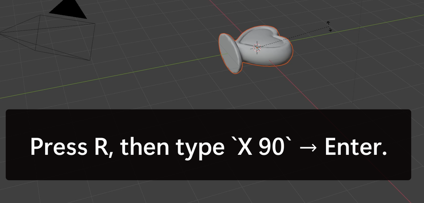 | 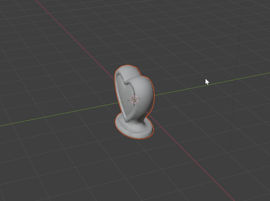

Your object should now be ready to go in Blender!
### ⚡ Object Imported, Bolt Collected! (3/10)

---

## Getting Creative

At this point, we've successfully brought our object into Blender and it's time to make it look like a hologram!

### 3. Prepare the Shader

- Select your object by clicking on it and then click on the **Shading tab** (this is Blender’s Shader Editor, where the magic happens).

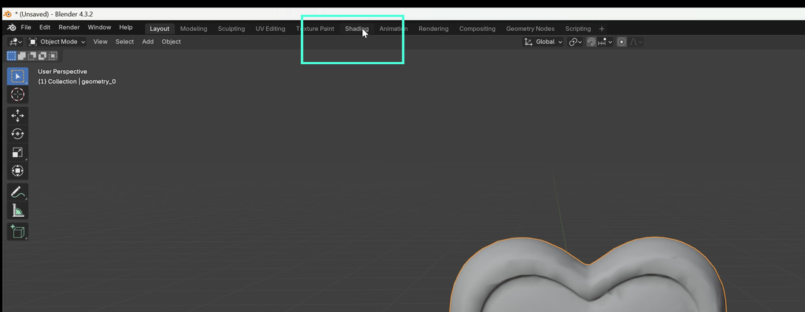

- Feel free to delete any default **Image Texture** or **Normal Map** nodes (click them and press Delete). We don’t need them.

*In Blender, a node is a little box in the Shader Editor that represents part of your material (like color, texture, or transparency). You connect these boxes with lines to control how the surface looks.*
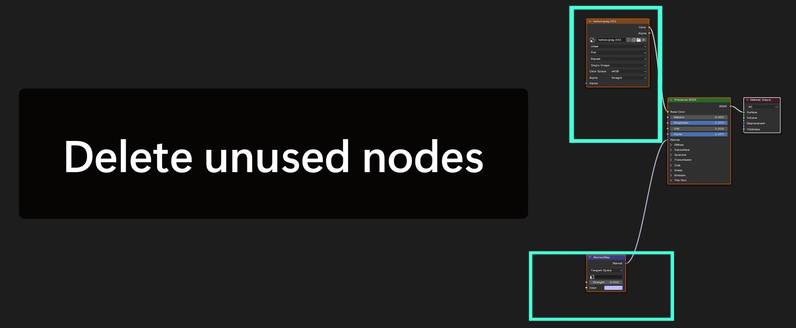

### 4. Set up Nodes for a Hologram

Setting up a node graph is like creating an assembly line for your texture. Each node changes the material before handing it off to the next. You can connect two nodes by clicking on the output circle of a node, dragging, and releasing it onto an input circle for the following node. You can see how the final node graph should look in the image below. 

1. **Node A - Add Wave Texture node** (`Shift+A → Texture → Wave Texture`).
    - We’ll start by generating a grayscale stripey pattern using the Wave Texture node. By default, Blender automatically maps this texture onto your object based on the object's shape (no UVs required!). The result is a set of clean, repeating bands.
2. **Node B - Add Color Ramp node** (`Shift+A → Converter → Color Ramp`).
    - Connect **Wave Texture → Color to Color Ramp Fac input**. 
    *You can connect two nodes by clicking the output (Color) and dragging & releasing over the next node's input (Fac).*
    - Color ramp nodes let us remap color gradients. Since we start with a wavy gradient of lines, it will help us choose how sharp our lines will look.
3. **Node C - Hook up transparency to Principled BSDF node:**
    - Connect **Color Ramp Color → Alpha input** of Principled BSDF to cut transparent holes in our object.
    - This makes the stripes cut transparent holes in your object.

    Now you’ll see stripes slicing through your model. That was a quick way to get an interesting effect!

    Zap charge rising…

### ⚡ Transparency detected, Bolt Collected! (4/10)

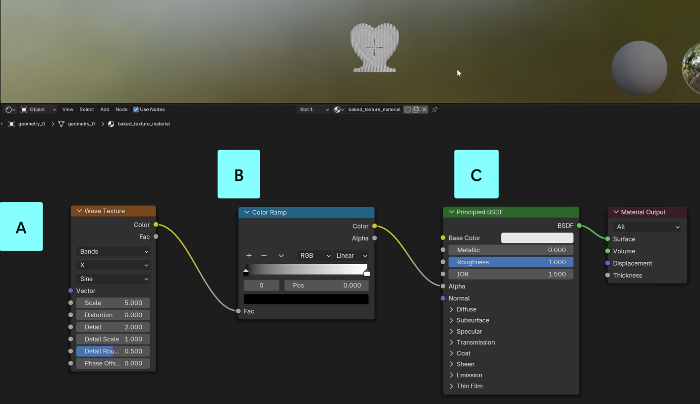

---

### 5. Tune the Style

This is where the process gets more intuitive and creative. We can take our node setup and try different tweaks. I'll tell you what I chose, but you should experiment and find what feels right to you. Let's start with the Wave Texture node.

### Wave Texture:
- **Direction:** Y (horizontal stripes)
    - In the second dropdown, we can change the direction of the stripes. By changing this value from **X** to **Y** we will end up with horizontal stripes as shown below. This makes the texture look more like scan lines to me.

- **Scale:** 7 (lots of medium lines). If you move this up, you'll get lots of thin lines, while lower values will give a chunkier look. By default, the lines are pretty thick, so I moved this value up to 7. 

- **Distortion:** 5 (medium wiggle)
    - I love this one. It adds wiggle to the lines, making them look more glitchy.

### Color Ramp:
- **Stops**: Black at 0.7, White at 0.77
- Think of the Color Ramp like a dimmer switch for light. A dimmer lets you fade smoothly from dark to bright. But when you push the sliders really close together, it’s like turning that dimmer into an on/off switch. The smooth fade suddenly becomes crisp, alternating bands.
- By setting the black stop to 0.7 and the white stop to 0.77, we squeeze the gradient into a very narrow range. This sharpens the stripes into clean, solid lines.
- Adjusting black stop: Pushing the black stop higher means more of the texture reads as “transparent” (or the background shows through).
- Adjusting white stop: Pulling the white stop lower makes the bands more filled in and solid.

### Principled BSDF
- The most important thing to consider on this node is the Base Color. I chose to make my color white so that I could easily use the Tint setting in Horizon Worlds to adjust my color. But, if you're already set on a specific shade, feel free to pick a color by clicking on the color block.

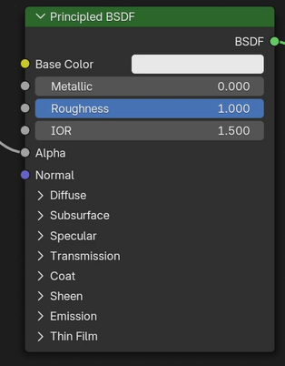

### Now, you should have your custom hologram looking just how you want! You can see my final node diagram below (nodes A, B, and C).  We'll set up node D next.

Zap charge rising…

### ⚡ What a Perfect Hologram, Bolt Collected! (5/10)

---

### 6. Bake the Texture

Now we preserve this visual moment in time forever, by baking the texture. "Baking" means turning the shader into a PNG file that Horizon can use. Let's choose our bake settings and preheat this zapper.

First we add an (unconnected) Image Texture node to set up the parameters of the baked image.
- Add **Image Texture node** (Shift+A → Texture → Image Texture).
- Click “New” → Name it `Heart_BA` → Resolution 1024 → Color = RGBA.
    - You can use a different name if you want, but it's important that you pick a primary name, and attach `_BA` onto the end of whatever you choose. [See naming requirements here.](#file-name-requirements)
    - Start with 1024px for your texture size. You can use a  lower texture size if you expect to have a lot of different textures, or higher texture size if you need sharper details, but keep performance in mind since large textures can impact world performance.

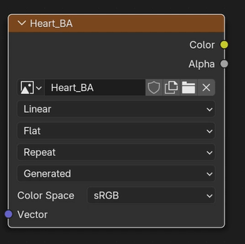
*Settings for the Image Texture node (Node D above)*

### Render Settings
- Now click on the camera icon to switch to **Render Properties**. 
    - *See box A below if you have trouble finding it.*
-  Set the Render Engine to Cycles 

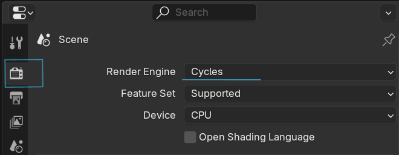
- Scroll down until you see the **Bake panel**
    - *See box B in image below*
    - Set Bake Type = Diffuse. 
    - Uncheck Direct and Indirect contributions in the Influence section
    - We're keeping our bake settings simple because we only need two layers: hologram stripes or transparent gaps.

### Put it in the Oven
- Make sure your object is selected (click on it)
- Hit  the big **Bake** button in box B. Wait a moment, this could take a minute or two. When the image is ready it will show up in the Image Viewer panel on the left side of the screen. At this point, you can see the texture image but it isn't saved outside of Blender.

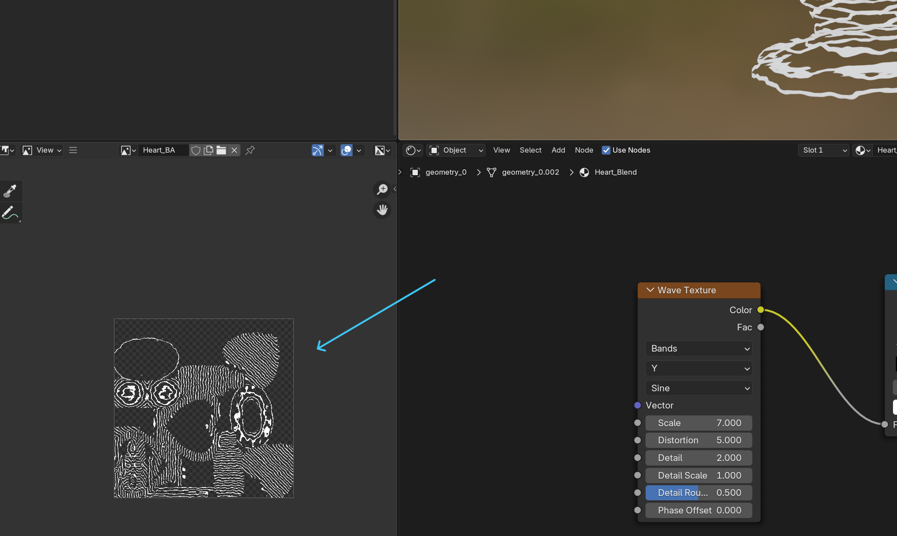

#### Troubleshooting Tips
- If your image looks black, make sure your object is selected (highlighted in the viewport) and try to Bake again. 
- If your image output looks different than mine, double check your node setups and connections.
- Keep an eye out for error popups at the bottom of your screen.

- Save your baked PNG to your same hologram directory: **Image (inside hamburger menu) → Save As → `Heart_BA.png`**.

### ⚡ Image Texture Complete, Bolt Collected! (6/10)

---

### File name requirements
- Horizon needs the **material name on the FBX** to match the **baked texture name** for transparency to work. It follows a very specific naming format.

| FBX Material Name      | Texture Name            | Channels                     | Notes |
|-----------------------|------------------------|-------------------------------|-------|
| MaterialName_Blend   | MaterialName_BA.png   | BaseColor (sRGB) + Alpha (opacity) | Blended/unlit material: does not receive or cast lighting or reflections |

- Example:
    - FBX Material: `Heart_Blend`
    - Baked PNG: `Heart_BA.png`

### Exporting the FBX

- Click on the Material tab (Box A below).
- Rename your material in the **Material tab** to `Heart_Blend` (Letter B)
    - The `_Blend` suffix tells Horizon “this has transparency.”
- With your object still selected, we will now export it. 
    - Click your object again: **File (Box C) → Export → FBX → Only Selected Objects**.
    - Check the box to only export the Selected Object (in Box D settings). This lets us easily export the heart, even if we have other things in our Blender scene. You can name your FBX file whatever you want, I called mine hologramheart.fbx.

Charge is rising..

### ⚡ All Files Exported, Bolt Collected! (7/10)

---

### Zap your Hologram INTO Horizon Worlds
- Back in Horizon, click **Add Asset** and choose **3D Model**. 
    

- Import both `Heart_BA.png` and `Heart.fbx`.
- Uncheck “Preserve rotation offset” → Import.
    - This setting is mostly used for models and rigs with multiple aligned parts.
    

I had trouble with this step the first time I tried it (so you will get TWO energy bolts once you get past it). You might get an error on your asset when trying to import. Double check that you've followed the [file name requirements](#file-name-requirements) precisely.

Once the asset has finished loading without any error messages, you can drag it into your scene!

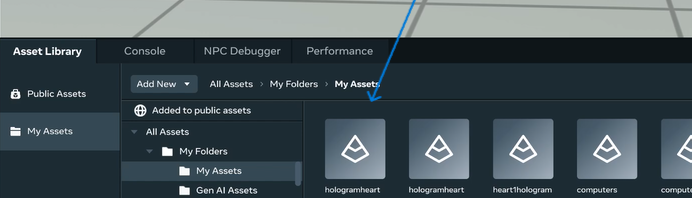

### ⚡ You Uploaded the Hologram, Bolt Collected! (8/10)
### ⚡ The Hologram Arrived, Bolt Collected! (9/10)

### Color

Adjust the tint value to change the color of your hologram.
-   Click on the hologram in your world
-   In the Properties menu, change the Tint Color

### ⚡⚡⚡⚡⚡ Zapper has zapped, Final Bolt Collected! (10/10) ⚡⚡⚡⚡⚡

### Congratulations! You’ve successfully zapped an ordinary object into a glowing hologram. Step back and admire your handiwork.

## Other Fun Ideas

### Darken your world’s lighting to make the hologram stand out.
- Add an Environment Gizmo 
- In the properties menu, Set the Skydome Type to 'Cubemap'
- Set the Texture to `Midnight Black`
- Since the hologram is unlit, it will stay colorful in the dark

### Add static lights inside your hologram so that they emit light around them.
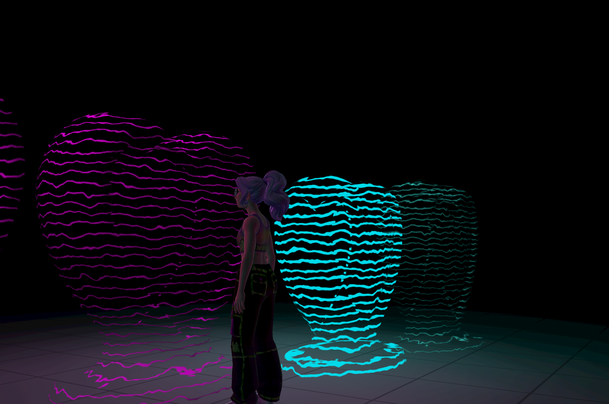

### Build an **entire hologram room**. Furniture, pets, even walls can use this workflow.
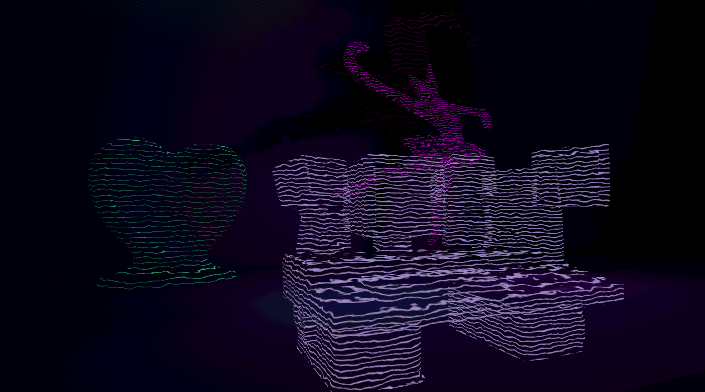

### Keep learning and experimenting with the Blender Shader Editor
- Swap the Wave Texture node for Voronoi for “techno crystal” look.
- Use additional Wave nodes to add more complexity to the fading pattern of your model. 
- Make your own original textures. Once you get comfortable with the node graph, you can make all sorts of patterns. Imagine a world made entirely out of chocolate chip cookie dough..
