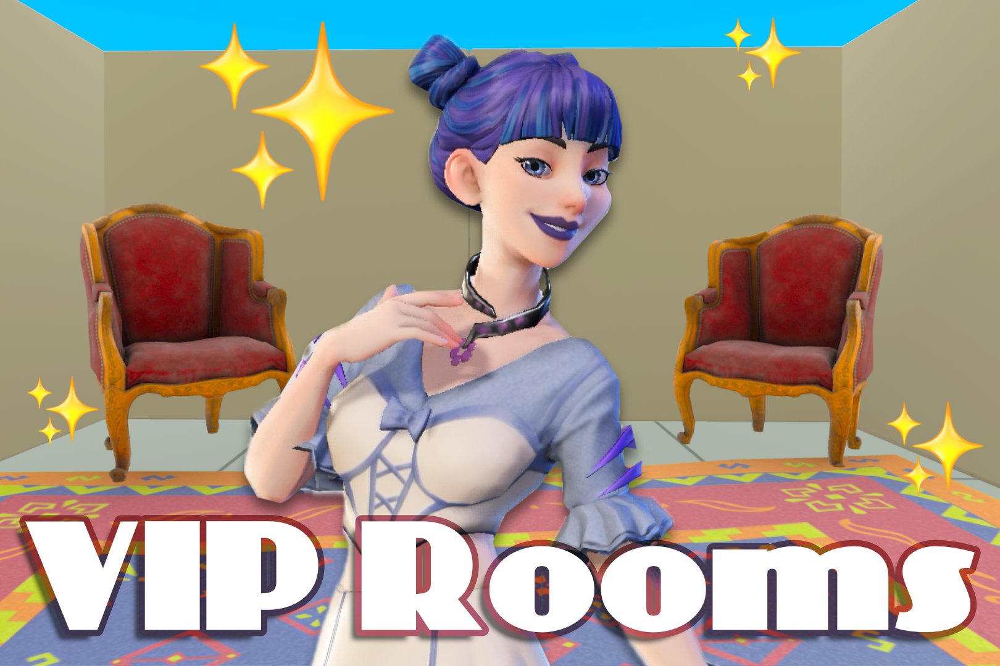
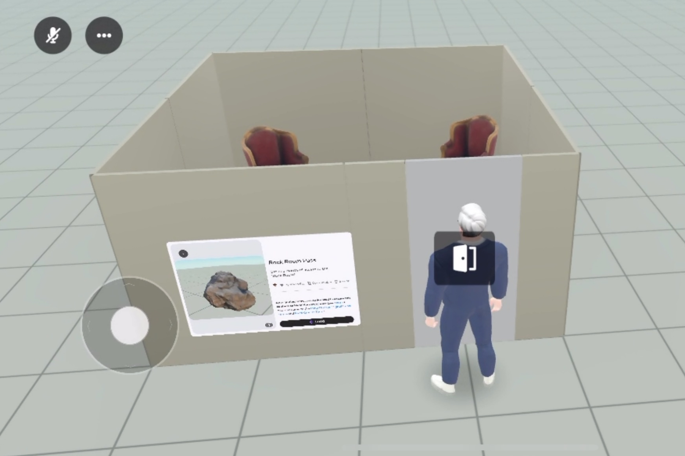
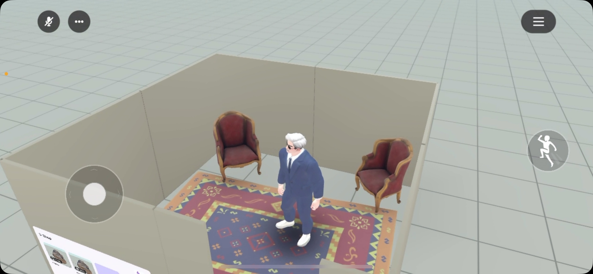
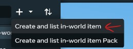
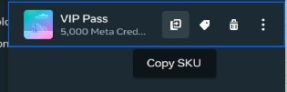
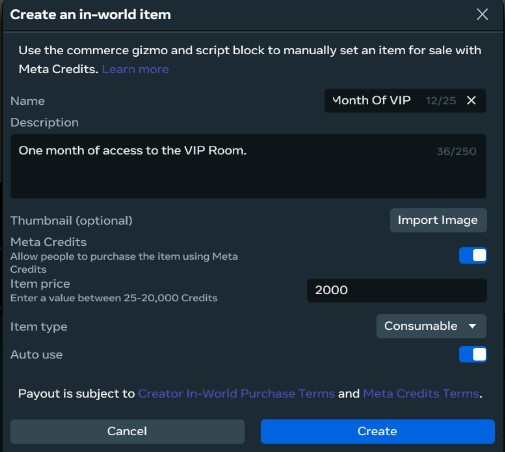
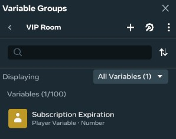

# Making an Exclusive VIP Room For Your World



A very common pattern world creators will use to monetize is to provide a world for free, but then gate certain rooms or features behind one-time purchases or subscriptions.

In this tutorial we'll explore how to set up a room that will only be accessible through in-world microtransactions.

[One Time Purchase](#one-time-purchase-gated-access)
[Subscriptions](#subscription-gated-access)

## Prerequisites 

Before setting up in-app purchases you will need to be part of the MHCP and set up your payout info at https://horizon.meta.com/creator/monetization_purchases/.

The Commerce menu item will not be shown anywhere until you've set up payout info, so it's essential that you do this first.

## World Setup

Before gating content, we need content to gate, and a gate to gate it with. Or for these examples, a door. 

For my examples I'm going to use the door we built in [this tutorial](../interaction/door.md) with some edits to it's interaction callback.

You don't need to go through the entire tutorial (though it's recommended when you have the time), if you want to follow along just 
go through the scene setup then copy and set up the script at the end of the tutorial.




## One-Time Purchase Gated Access

If we want our room tied to a one-time purchase, what we want to use is a "durable" in world item purchase. "Durable" in world purchases are items 
that players can only buy or be given one instance of, and can't be removed from their inventory. Perfect for representing a one-time purchase!

First we need to create a durable item for our players to be able to purchase. Follow the steps above in [Prerequisites](#prerequisites) to make sure 
you have access to the Commerce menu. Inside the desktop editor you can find it at Systems -> Commerce from the main menu bar. 

Click the + and select "Create and list in-world item"



Next, making sure the item type is set to durable, give your key item a good name, description, and icon. And if you really want to go the extra mile
set an Asset reference, air on the side of simplicity with the asset if you do add it since players are able to freely toggle it in and out of existence
through their Horizon Worlds inventory.

WARNING: All of the details here except price are permanent, and once the item is owned by a single player you will be unable to delete it. The name will
also be permanently taken by this item. It's good practice to create a couple test items with throw-away names to make sure everything is working before creating an
item with the final name you want to use.

When choosing a price refer to [this page on price setting](https://developers.meta.com/horizon-worlds/learn/documentation/mhcp-program/monetization/setting-in-world-purchase-pricing).


Now that we have that created, we can reference SKU of the item in our scripts. To grab the sku of an item, open the commerce menu and click the leftmost button on an item:



From this point on editing our door to require this "key item" is easy. First add two props, one to turn on key validation, the other to set what item to use as the key.

```typescript
requiresKey: { type: hz.PropTypes.Boolean },
keyItemSKU: { type: hz.PropTypes.String },
```

Then we need to add a quick check inside our Interaction callback to first check both if we need a key, and if we have a key before letting a player interact with a door.

```typescript
// What we had before
this.connectCodeBlockEvent(trigger, hz.CodeBlockEvents.OnPlayerEnterTrigger, (player)=> {
  this.toggle();
});

// Turns into this
this.connectCodeBlockEvent(trigger, hz.CodeBlockEvents.OnPlayerEnterTrigger, (player)=> {
  if (this.props.requiresKey) {
    if(!hz.WorldInventory.doesPlayerHaveEntitlement(player, this.props.keyItemSKU)) {
      hz.InWorldPurchase.launchCheckoutFlow(player, this.props.keyItemSKU);
      return;
    }
  }
  this.toggle();
});
```
Owned items are called "entitlements" so by asking if a player has an entitlement, we're actually asking if they own an item. Though it works in this case 
as what we're really asking is "are they entitled to open this door?".

If they don't own the item we help them out and open a popup with `hz.InWorldPurchase.launchCheckoutFlow` where they may buy the key item if they so choose.

Now our door should both prompt players to buy a key, and let them in if they already own it!.

Something worth noting is that you can directly give players items without making them pay for them using `hz.InWorldPurchase.grantItemToPlayer` and this
same system will work. So if you want your player to have persistent indications of progress showing up in their world inventory, this is a way to do that
even without transactions!

## Subscription Gated Access

Now, what if your room is really special, and deserves more than just one purchase? Horizons doesn't have native subscriptions at this time, but using consumable
items we can create our own time-based subscriptions!

The steps are initially the same as for one-time purchase keys, but we use consumable items plus persistent variables, so it's a little more complicated.

Navigate to Systems -> Commerce, click the +, and select "Create and list in-world item"


Fill out the details of the item, again be careful with names, descriptions, and icons as they are permanent.
Unlike durable items we don't get to choose an in-world representation of this item, so no flashing a fancy VIP card in-world.

Make sure `Item Type` is set to "Consumable" `Auto Use` is set to true. 



Now before we can get to scripting, we also need to set up a persistent variable to store when the subscription expires.

The IWPSeller gizmo does provide a method to get how long it's been since the purchase of an item, but this doesn't account for multiple purchase, so we need to track
expiration separately to make sure our users get their money's worth if they purchase multiple months at once. (There is currently no way to prevent multiple 
purchases of consumables, so we do have to account for multiple). Our solution to this is calculating the combined expiration time of each purchased consumable. Meaning that purchasing 3 separate subscriptions will result in a 90 day expiration instead of three simultaneous 30 day subscriptions.

To create our expiration variable, go to Systems -> Variable Groups and create a new group for our VIP room. Then within that group create a new "Player Persistent Variable" of type "Number".



Now we need a way to update this variable whenever a purchase occurs. We can use a IWPSeller gizmo script to do this.

IWPSeller lets us listen to when money and item related events occur in our world, and choose how we want to respond to them.

In this case we're interested in `OnItemConsumeComplete`. Since we have our subscription item set to auto use, this event will be fired when users buy a month of subscription.

```typescript
import * as hz from 'horizon/core';

class PurchaseManager extends hz.Component<typeof PurchaseManager> {
  static propsDefinition = {
    subscriptionItemSku: { type: hz.PropTypes.String },
    subscriptionVariableId: { type: hz.PropTypes.String } 
  };

  start() {
    this.connectCodeBlockEvent(this.entity!, hz.CodeBlockEvents.OnItemConsumeComplete, (player, item, success)=>{
      console.log(`Item ${item} consumed = ${success} by player: ${player.name}`);
      if(!success || item != this.props.subscriptionItemSku)
        return;
      let expiration = this.world.persistentStorage.getPlayerVariable(player, this.props.subscriptionVariableId);
      console.log(`Current expiration: ${expiration}`);
      // Calculate the number of milliseconds in a month
      const monthMs = 60 * 60 * 24 * 31 * 1000;
      // Either add to our current subscription, or set the expiration out a month from now
      expiration = Math.max(Date.now() + monthMs, expiration + monthMs);
      console.log(`New expiration: ${expiration}`);
      this.world.persistentStorage.setPlayerVariable(player, this.props.subscriptionVariableId, expiration);
    });
  }
}
hz.Component.register(PurchaseManager);
```

Add this script to any IWPSeller gizmo in your world. You can find what to set the properties by hovering over both items and persistent variables and clicking their respective copy buttons.
For items, you can copy their SKU, for persistent variables you can copy their IDs. In both cases this is what we want to put into the public property fields in the editor when setting up our
IWPSeller gizmo.

Now that we have a variable that will always contain the expiration date of our subscription, we can finally set our door up to check that value.

I'm going to set up my door so that we can optionally use keys, subscriptions, or both, but you can only implement one or the other if you want.

To add subscriptions to a door that already can require a key we first add these members to our propsDefinition:
```typescript
requiresSubscription: { type: hz.PropTypes.Boolean },
subscriptionVariableId: { type: hz.PropTypes.String },
subscriptionItemSku: { type: hz.PropTypes.String },
```

Then we want to change our interaction callback to check both keys and ids:
```typescript
this.connectCodeBlockEvent(trigger, hz.CodeBlockEvents.OnPlayerEnterTrigger, (player)=> {
  if (this.props.requiresKey) {
    if(!hz.WorldInventory.doesPlayerHaveEntitlement(player, this.props.keyItemSKU)) {
        // Prompt user to buy key
      hz.InWorldPurchase.launchCheckoutFlow(player, this.props.keyItemSKU);
      return;
    }
  }
  if (this.props.requiresSubscription) {
    let expiration = this.world.persistentStorage.getPlayerVariable(player, this.props.subscriptionVariableId);
    if(expiration < Date.now()) {
        // Prompt user to buy subscription
        hz.InWorldPurchase.launchCheckoutFlow(player, this.props.subscriptionItemSku);
        return;
    }
  } 
  
  this.toggle();
});
```
Since all the purchase flow is handled for us, and the expiration time is pre-calcualted by the IWPSeller gizmo script, all we need to do to is a simple less-than check to see if a player 
has an active subscription.

It's important when setting this up to make sure that the variable ID and itemSKU you set up on the IWPSeller gizmo and door are exactly the same, otherwise your players will be locked out of the room
even though they're completing purchases.

You may want to consider setting up the item SKU and variable Id on a constant object imported by both structs instead of manually setting them in the editor to avoid bugs:
```typescript
export const Subscription =  {
  subscriptionItemSku: "vip_room_pass_0d1b59ca",
  subscriptionVariableId: "VIP Room:Subscription Expiration",
};
```

Note that this won't let players in if they have a key *or* a subscription, this will require both. So probably best to only have one mode turned on at a time.


And with that, you now can gate access to a room in your world! With a little bit of remixing you can also apply these concepts to many other world features!
